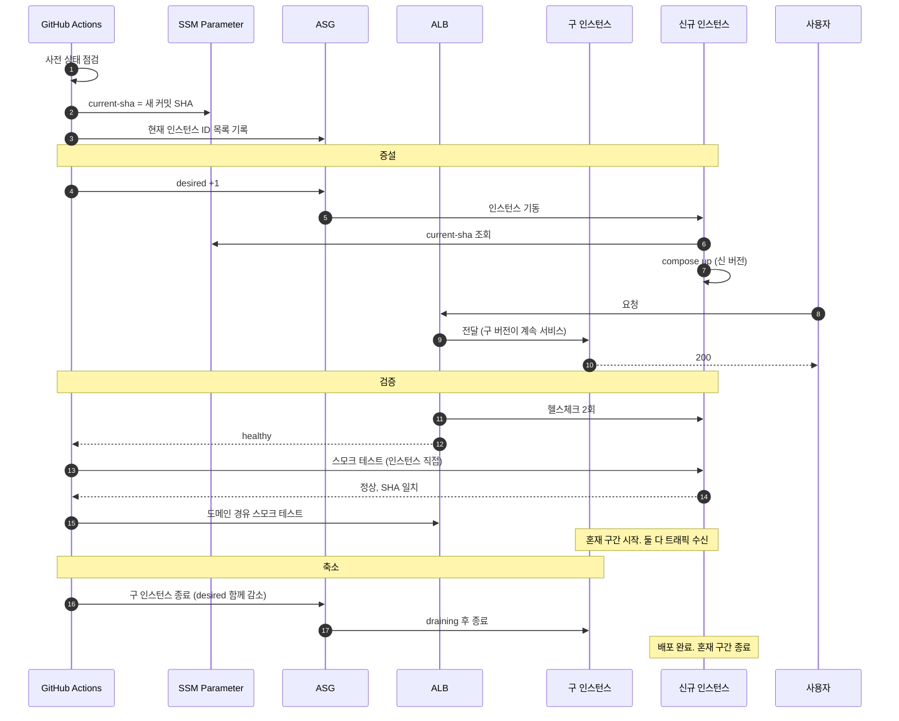
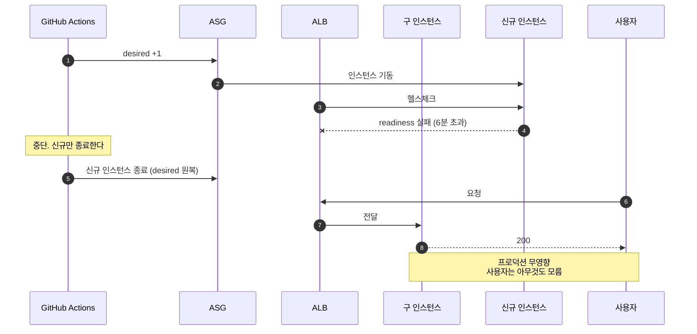

# 무중단 배포 설계: 인스턴스 롤링 (백엔드 공통)

작성 기준일: 2026-08-02
적용 대상: ALB + ASG + Docker Compose 구성
관련 문서: [백엔드공통_기술스택_확정문서.md](./백엔드공통_기술스택_확정문서.md), [백엔드공통_장애대응목표와_아키텍처결정.md](./백엔드공통_장애대응목표와_아키텍처결정.md), [백엔드공통_앱과DB_장애대응구조.md](./백엔드공통_앱과DB_장애대응구조.md), [백엔드공통_배치_설계.md](./백엔드공통_배치_설계.md)

---

## 1. 문서 목적과 채택 근거

무중단 배포를 인스턴스 단위 롤링으로 구현한다. 다른 방식과의 비교는 부록 A에 남긴다.

**채택 근거는 이 인프라의 성격이다.** 운영 환경에 올라가기 전의 검증 환경이므로 배포 실패가 실사용자에게 미치는 영향이 없다. 반면 배포 시간은 곧 검증 반복 횟수를 결정한다. 이 조건에서는 실패 시 영향 범위를 줄이는 것보다 반복 속도를 확보하는 편이 낫다.

| 항목 | 값 |
|---|---|
| 전환 방식 | 대상 그룹 하나 안에서 인스턴스를 교체 |
| 교체 단위 | 컨테이너가 아니라 인스턴스 |
| 배포 중 용량 | 100% |
| 배포 소요 | 6~8분 |
| 롤백 소요 | 6~8분 |
| 혼재 구간 | 약 1분 |
| 추가 인스턴스 | 배포 중 1대 |

신규 인스턴스를 먼저 띄운다는 점에서 대상 그룹 스왑과 비슷해 보이나 다르다. **대상 그룹이 하나이므로 신규가 등록된 뒤 구 인스턴스를 종료할 때까지 둘 다 트래픽을 받는다.** 전환이 점진적이라는 점이 롤링의 본질이며, 트래픽이 한 순간에 100% 넘어가는 대상 그룹 스왑과 구별된다. 비교는 부록 A를 참조한다.

---

## 2. 전제와 사전 점검

### 2.1 인프라는 상시 가동을 전제한다

**모든 인프라 리소스는 기본적으로 종료되지 않는다.** ALB, RDS, ElastiCache, 모니터링 인스턴스, 앱 ASG는 항상 떠 있다. 비용 기준도 한 달 상시 운영이다.

비용 절감을 위해 리소스를 중지하거나 파괴하는 것은 **운영자가 스크립트로 명시적으로 실행하는 예외 작업**이다. 자동화된 정기 절차가 아니며, 본 문서의 배포 절차는 그런 작업이 없었다고 가정하지 않는다. 대신 모든 절차는 **실행 전에 리소스 상태를 확인하고 진행한다.**

절감 방안의 상세는 기술 스택 문서 부록 A를 참조한다.

### 2.2 배포 전 상태 점검

배포는 아래를 확인한 뒤에만 시작한다. 하나라도 어긋나면 중단하고 원인을 먼저 해소한다.

| 대상 | 기대 상태 | 어긋났을 때의 의미 |
|---|---|---|
| RDS | `available` | 중지되었거나 유지보수 중. 교체된 인스턴스가 기동에 실패 |
| ElastiCache | `available` | 캐시 없이 배포하면 강등 경로가 섞여 판정이 흐려짐 |
| 모니터링 인스턴스 | `running`, Prometheus 응답 | 관측 없이 배포하면 배포 영향 판정 불가 |
| 대상 그룹 | healthy 2/2 | **이미 용량이 절반. 롤링을 시작하면 서비스가 끊긴다** |
| ACM 인증서 | 잔여일 30일 초과 | 배포 중 만료되면 전면 접속 불가 |
| Route 53 헬스체크 | 정상 | 외부에서 접속 불가한 상태 |

```bash
#!/usr/bin/env bash
set -euo pipefail

fail() { echo "사전 점검 실패: $1" >&2; exit 1; }

RDS_STATUS=$(aws rds describe-db-instances \
  --db-instance-identifier "$DB_ID" \
  --query 'DBInstances[0].DBInstanceStatus' --output text)
[ "$RDS_STATUS" = "available" ] || fail "RDS 상태가 $RDS_STATUS"

HEALTHY=$(aws elbv2 describe-target-health --target-group-arn "$TG_ARN" \
  --query "length(TargetHealthDescriptions[?TargetHealth.State=='healthy'])" --output text)
DESIRED=$(aws autoscaling describe-auto-scaling-groups \
  --auto-scaling-group-names "$ASG_NAME" \
  --query 'AutoScalingGroups[0].DesiredCapacity' --output text)
[ "$HEALTHY" -ge "$DESIRED" ] || fail "대상 그룹 healthy $HEALTHY/$DESIRED"
```

**대상 그룹 점검이 가장 중요하다.** 롤링은 정상 인스턴스 하나를 일부러 빼는 방식이므로, 이미 하나가 비정상인 상태에서 시작하면 서비스가 통째로 끊긴다.

부하 시험이나 장애 주입 시험을 시작할 때는 위 항목에 더해 CPU 크레딧 잔량을 확인한다. 배포와 달리 시험은 **측정 결과의 신뢰성**이 걸려 있어 판정 기준이 다르다. 상세는 기술 스택 문서 부록 A.9에 있다.

---

## 3. 구조

```
Route 53   api.example.com --alias--> ALB
                                       |
                                리스너 443
                                       |
                                  tg-app
                                       |
                            ASG-app (desired 1)
                                       |
                                 app-1 (AZ-a)
```

구성이 단순하다. ASG 하나와 대상 그룹 하나가 전부이며, 배포를 위한 별도 리스너나 상태 테이블이 없다.

| 구성요소 | 개수 |
|---|---|
| ASG | 1 |
| 대상 그룹 | 1 |
| 리스너 | 2 (443, 80 리다이렉트) |

---

## 4. 현재 버전의 진실을 어디에 두나

**이 방식의 핵심 장치다.** 신규 인스턴스는 user-data에서 SSM 값을 읽어 컨테이너를 띄운다. 즉 SSM 값이 곧 "지금 배포되어야 할 버전"이며, 배포는 이 값을 바꾸고 인스턴스를 새로 띄우는 것으로 성립한다.

같은 장치가 장애 복구에도 쓰인다. ASG가 인스턴스를 교체할 때도 SSM 값을 읽으므로, 시작 템플릿에 태그가 고정되어 있을 때 생기는 "장애 복구가 곧 버전 롤백"이 되는 사고를 막는다.

### 4.1 문제

```
t0    v3 배포 완료. 실행 중인 인스턴스는 모두 v3
t100  인스턴스 소실 (하드웨어 장애)
t180  ASG가 시작 템플릿으로 새 인스턴스 기동
      -> user-data 가 어떤 태그를 pull 해야 하는가?
```

시작 템플릿에 이미지 태그가 고정되어 있으면 **최초 구축 시점의 버전이 올라온다.** 장애 복구가 곧 버전 롤백이 되는 사고이며, 두 인스턴스의 버전이 달라져 혼재 구간이 무기한 지속된다.

### 4.2 해결

현재 버전을 SSM Parameter Store에 두고 user-data가 읽게 한다. 표준 파라미터는 무료다.

```bash
# 시작 템플릿의 user-data
CURRENT_SHA=$(aws ssm get-parameter --name "/${PROJECT}/current-sha" \
  --query 'Parameter.Value' --output text)

export GIT_SHA="$CURRENT_SHA"
docker compose pull
docker compose up -d
```

배포 스크립트는 컨테이너를 교체하기 전에 이 값을 먼저 갱신한다.

```bash
aws ssm put-parameter --name "/${PROJECT}/current-sha" \
  --value "$GIT_SHA" --type String --overwrite
```

**갱신을 교체보다 먼저 하는 이유**는 배포 도중에 인스턴스가 소실될 수 있기 때문이다. 나중에 갱신하면 그 사이에 교체된 인스턴스가 구버전으로 올라온다.

### 4.3 롤백 시에도 동일하다

롤백은 이전 SHA로 같은 절차를 반복하는 것이므로, SSM 값도 함께 되돌린다. 되돌리지 않으면 롤백 직후 ASG가 인스턴스를 교체할 때 되돌리려던 버전이 다시 올라온다.

---

## 5. Terraform과 CLI의 경계

**인프라 정의는 Terraform, 배포는 CLI다.**

| 대상 | 관리 주체 | 이유 |
|---|---|---|
| ASG, 시작 템플릿 | Terraform | 인프라 정의 |
| 대상 그룹, 리스너 | Terraform | 인프라 정의 |
| SSM 파라미터 리소스 자체 | Terraform | 인프라 정의 |
| SSM 파라미터의 값 | **CLI** | 배포마다 바뀌는 상태 |
| 대상 등록과 해제 | **CLI** | 배포 중 일시 상태 |
| ASG desired capacity | **CLI** | 운영 명령 |

```hcl
resource "aws_ssm_parameter" "current_sha" {
  name  = "/${var.project}/current-sha"
  type  = "String"
  value = "bootstrap"

  lifecycle {
    ignore_changes = [value]   # 배포 스크립트가 갱신한다
  }
}

resource "aws_autoscaling_group" "app" {
  name                = "${var.project}-app"
  target_group_arns   = [aws_lb_target_group.app.arn]
  vpc_zone_identifier = var.app_subnet_ids
  health_check_type   = "ELB"
  min_size            = 0
  max_size            = 2
  desired_capacity    = 1

  lifecycle {
    ignore_changes = [desired_capacity]
  }
}
```

`ignore_changes`를 걸지 않으면 다음 apply에서 SSM 값이 `bootstrap`으로 되돌아간다.

`desired_capacity` 의 하한이 1인 것은 한산할 때 앱을 1대로 운영하기로 했기 때문이다(`INF-39`).
2026-08-29 부터 이 값은 오토스케일링 정책이 1~3 사이에서 움직인다.
**3대까지 올라간 동안에는 배포가 막힌다.** 신규가 설 자리가 없어서다 (오토스케일링 설계 문서 4절).
**배포 중에는 이 값이 일시적으로 2가 되므로 `max_size`가 2여야 한다.**
`desired_capacity`를 2로 두면 배포 때 인스턴스를 더 띄울 자리가 없어 이 절차가 성립하지 않는다.

---

## 6. 배포 절차

```
 0. 사전 상태 점검 (2.2절)                        [실패 시 즉시 중단]
 1. 이미지 빌드, GHCR push (태그 = 커밋 SHA)
 2. SSM /current-sha 갱신                         [교체보다 먼저]
 3. 현재 인스턴스 ID 목록 기록                     [구 버전 식별용]
 4. ASG desired +1                                [신규는 신 버전으로 기동]
 5. 신규 인스턴스 healthy 대기                     [최대 6분]
 6. 신규 인스턴스 로컬 스모크 테스트                [인스턴스 IP 직접]
 7. ALB 경유 스모크 테스트                         [도메인]
 8. 실패 시 중단. 신규만 종료하고 구 버전은 그대로 서비스
 9. 3번에서 기록한 구 인스턴스를 종료
10. 최종 확인
```

3번과 9번이 이 절차의 핵심이다. ASG는 인스턴스에 버전 표시를 하지 않으므로, 배포 전 목록을 기록해 두지 않으면 나중에 어느 것이 구 버전인지 알 수 없다.

```bash
# 3번: 배포 전 인스턴스 목록을 기록한다
OLD_IDS=$(aws autoscaling describe-auto-scaling-groups \
  --auto-scaling-group-names "$ASG_NAME" \
  --query 'AutoScalingGroups[0].Instances[].InstanceId' --output text)

# 9번: 구 인스턴스만 지정해 종료하고 desired 도 함께 줄인다
for ID in $OLD_IDS; do
  aws autoscaling terminate-instance-in-auto-scaling-group \
    --instance-id "$ID" --should-decrement-desired-capacity
done
```

**이 절차는 인스턴스 수에 무관하게 동작한다.** desired가 3이면 4로 늘렸다가 기록해 둔 3개를 차례로 종료한다. 인스턴스 수를 하드코딩하지 않는 것이 요점이다.

### 6.1 스모크 테스트를 두 번 하는 이유

readiness는 애플리케이션이 기동을 마쳤다는 것만 말한다. **실제 API가 올바른 응답을 내는지, 그리고 ALB 경로가 제대로 연결되었는지는 알려주지 않는다.**

롤링에는 프로덕션 트래픽을 받기 전에 검증하는 별도 경로가 없다. 대신 교체 직후와 재등록 직후 두 지점에서 나눠 확인한다.

| 시점 | 호출 대상 | 검증 범위 | 검증 못 하는 것 |
|---|---|---|---|
| 7번 (재등록 전) | 인스턴스 IP 직접 | 애플리케이션 로직, DB 연결, 캐시 연결 | ALB 리스너 규칙, 인증서, 라우팅 |
| 9번 (재등록 후) | 도메인 (ALB 경유) | 전체 경로 | 사용자 트래픽이 이미 흐르는 상태 |

**7번이 더 안전한 검사다.** 이 시점에는 app-1이 대상 그룹에서 빠져 있어 사용자 트래픽을 받지 않으므로, 실패해도 영향이 없다. 반면 9번은 이미 트래픽을 받는 상태라 문제가 있으면 일부 요청이 실패한 뒤에 발견된다.

그래서 **애플리케이션 수준 검증은 최대한 7번에 몰아넣고, 9번은 경로 확인만 최소한으로 한다.**

```bash
# 7번: 인스턴스 직접. 트래픽 없는 상태이므로 충분히 검사한다
curl -fsS "http://${INSTANCE_IP}:8080/actuator/health" > /dev/null
curl -fsS "http://${INSTANCE_IP}:8080/actuator/info" | grep -q "$GIT_SHA"
curl -fsS "http://${INSTANCE_IP}:8080/v1/health/deep" > /dev/null   # DB, 캐시 왕복 확인

# 9번: ALB 경유. 경로와 인증서만 확인한다
curl -fsS "https://${DOMAIN}/actuator/health" > /dev/null
```

`/actuator/info`에서 커밋 SHA를 확인하는 것이 중요하다. **컨테이너 교체가 실제로 일어났는지 검증하는 유일한 수단**이다. `docker compose up -d`가 이미지 pull 실패로 구 컨테이너를 그대로 둔 경우, readiness는 통과하지만 버전은 바뀌지 않는다.

`build-info`를 노출하려면 Gradle 설정이 필요하다.

```gradle
springBoot {
    buildInfo()
}
```

### 6.2 배포 시퀀스

**8번이 안전장치다.** 신규 인스턴스가 검증을 통과하지 못하면 신규만 종료하고 구 인스턴스는 그대로 둔다. 프로덕션은 영향받지 않는다.



**혼재 구간이 존재한다는 점이 대상 그룹 스왑과 다르다.** 신규가 등록된 시점부터 구 인스턴스가 종료될 때까지 ALB는 양쪽으로 요청을 나눠 보낸다. 이 구간은 약 1분이며, 8절의 규칙이 여기에 적용된다.

### 6.3 검증 실패 시퀀스



**구 인스턴스를 건드리기 전에 검증이 끝나므로 실패해도 서비스가 온전하다.** 컨테이너를 직접 교체하는 방식과 결정적으로 다른 지점이다. 다만 원인을 해소하기 전까지는 배포가 막히므로, 실패 알림은 즉시 받아야 한다.

---

## 7. 롤백

롤백 방법은 시점에 따라 다르다.

| 시점 | 방법 | 소요 |
|---|---|---|
| 구 인스턴스 종료 전 (6절 9번 이전) | 신규만 종료 | 1~2분 |
| 구 인스턴스 종료 후 | 이전 SHA로 배포 재수행 | 6~8분 |

```
구 인스턴스 종료 후 롤백
1. SSM /current-sha 를 이전 SHA 로 갱신
2. 6절 3~9 반복
```

**9번을 늦출수록 빠른 롤백이 가능하다.** 신규가 healthy가 된 뒤 관찰 구간을 두면 그동안은 1~2분에 되돌릴 수 있다. 다만 그 구간만큼 인스턴스 2대가 유지되므로 비용과 DB 커넥션이 늘어난다.

| 신호 | 조건 | 동작 |
|---|---|---|
| readiness 미통과 | 90초 초과 | 해당 인스턴스에서 중단 |
| 5xx 비율 | 배포 전 대비 2배, 3분 지속 | 자동 롤백 |
| ALB 502 발생 | 임계 초과 | 자동 롤백 |
| p99 응답시간 | 배포 전 대비 3배 | 경보 후 수동 판단 |
| Route 53 헬스체크 실패 | 2회 연속 | 즉시 수동 개입. **현재 헬스체크가 없다 (`INF-38`)** |

**롤백 스크립트는 매 배포 후 한 번씩 연습한다.** 평소에 실행되지 않는 코드는 정작 필요한 순간에 처음 돌아간다. 연습에 6~8분이 들지만, 사고 시점에 처음 돌리는 것보다 낫다.

---

## 8. 혼재 구간과 그것이 강제하는 규칙

신규 인스턴스가 대상 그룹에 등록된 시점부터 구 인스턴스가 종료될 때까지 약 1분간 서로 다른 버전이 동시에 트래픽을 처리한다. 관찰 구간을 두면 그만큼 길어지고, 배포가 중단되면 무기한 지속된다.

**이 구간에서는 두 버전이 모두 실제 요청을 처리한다.** 같은 API를 호출해도 요청마다 다른 버전에 도달할 수 있다.

### 8.1 스키마는 확장 후 축소만 허용한다

```sql
-- 1차 배포: 추가만 한다. 두 버전 모두 동작한다.
ALTER TABLE account ADD COLUMN token_invalidated_at DATETIME(3) NULL;

-- 신 버전 안정화 후 별도 배포에서 구 컬럼을 정리한다.
```

| 금지 | 이유 |
|---|---|
| 컬럼 삭제 | 구 버전이 조회하다 실패. 롤백 불가 |
| 컬럼 이름 변경 | 삭제와 추가의 조합 |
| NOT NULL 제약 추가 (기본값 없이) | 구 버전의 INSERT 실패 |
| 타입 축소 | 구 버전이 쓰던 값이 들어가지 않음 |

CI에서 파괴적 DDL을 감지해 차단한다.

### 8.2 API 응답 형식도 같은 규칙을 받는다

혼재 구간에는 클라이언트가 요청마다 다른 버전에 도달한다. 응답 필드를 제거하거나 이름을 바꾸면 클라이언트가 요청마다 다르게 동작한다. 필드 추가만 허용하고, 제거는 클라이언트 전환이 끝난 뒤 별도 배포로 한다.

### 8.3 배치는 조건부 UPDATE로 방어한다

배치 인스턴스는 롤링 대상이 아니라 중지 후 교체하므로 혼재 구간이 없다.
그래도 배치는 중지로 중간에 끊기고 다음 주기에 다시 돈다. **재실행이 안전해야 한다는 요구는 그대로다.**

```java
int transitioned = jdbcTemplate.update("""
        UPDATE reservation
           SET status = 'EXPIRED', updated_at = ?
         WHERE id = ? AND status = 'PENDING'
        """, Timestamp.from(now), recordId);

if (transitioned == 0) {
    return;   // 누적 연산도 하지 않는다
}
resourceService.release(recordId);
```

두 버전이 모두 활성이므로 어느 한쪽의 배치를 선택적으로 멈출 수단이 없다. **따라서 조건부 UPDATE가 유일한 방어선이 된다.**

배치 주기가 혼재 구간보다 길면 위험이 줄지만, 배포가 중단된 상태에서는 그 가정이 깨진다.

---

## 9. 부하 시험과의 관계

**부하 시험 중에는 배포하지 않는다.** 이것은 권고가 아니라 규칙이다.

배포 중 용량은 유지되지만 **DB 커넥션이 일시적으로 두 배가 된다.** 신규 인스턴스가 커넥션 풀을 채우는 동안 구 인스턴스도 그대로 점유하고 있기 때문이다.

부하 시험 중이면 이미 커넥션이 활성 상태인데 여기에 얹히므로 `max_connections` 한도에 닿을 수 있다. 또한 RDS는 Unlimited 모드를 끌 수 없어 CPU 크레딧 과금이 가중된다.

혼재 구간에 두 버전이 함께 트래픽을 받는 점도 측정을 오염시킨다. 그 구간의 지연이 어느 버전 때문인지 구분할 수 없다.

| 목적 | 배포와 부하를 |
|---|---|
| 성능 기준선 측정 | 분리 |
| 배포 안전성 검증 | 저부하에서 수행 |

---

## 10. 비용

배포 중 신규 인스턴스가 살아 있는 시간만 추가로 과금된다.

| 항목 | 계산 | 배포 1회당 |
|---|---|---|
| EC2 t3.small 1대 | 0.026 x 0.25시간 | 0.007 USD |
| EBS gp3 30GB | 15분치 | 0.001 USD |
| GHCR 이미지 pull (인바운드) | 무료 | 0 |
| SSM 표준 파라미터 | 무료 | 0 |
| 합계 | | 약 0.01 USD |

월 20회 배포해도 0.2 USD로 무시할 수 있다. 다만 **9번 단계에서 구 인스턴스를 종료하지 않으면 월 18.98 USD가 그대로 굳는다.**

---

## 11. 검증 계획

| 항목 | 내용 |
|---|---|
| 주입 | 저부하 상태에서 정상 배포 수행 |
| 확인 1 | 혼재 구간과 구 인스턴스 종료 시 오류율 0인가 |
| 확인 2 | 배포 총 소요가 6~8분인가 |
| 주입 | 기동에 실패하는 이미지로 배포 |
| 확인 3 | 신규 인스턴스만 종료되는가 |
| 확인 4 | 구 인스턴스가 영향 없이 서비스를 유지하는가 |
| 주입 | 배포 직후 인스턴스 하나를 종료 |
| 확인 5 | **ASG가 교체한 인스턴스가 신 버전으로 올라오는가** |
| 주입 | 배포와 배치 주기를 의도적으로 겹침 |
| 확인 6 | 두 버전 동시 실행에도 데이터 손상이 0인가 |
| 주입 | 이미지 pull 이 실패하도록 태그를 잘못 지정 |
| 확인 8 | 스모크 테스트가 SHA 불일치를 잡아내는가 |
| 주입 | 이전 SHA로 롤백 수행 |
| 확인 9 | SSM 값이 함께 되돌려지는가 |

**확인 5가 롤링 고유의 검증 항목이다.** 4절의 SSM 장치가 동작하는지 확인하는 것이며, 이 검증이 없으면 장애 복구가 버전 롤백을 일으키는 사고를 배포 몇 번 뒤에야 발견하게 된다.

---

## 12. 실패 모드와 안전장치

| 실패 모드 | 결과 | 안전장치 |
|---|---|---|
| SSM 갱신 누락 | ASG 교체 시 구버전 기동 | 2번 단계를 절차에 고정, 확인 5 |
| 구 인스턴스 종료 누락 | 인스턴스 2대가 계속 과금 | 9번 단계 확인, 사전 점검의 desired 대조 |
| 이미 healthy 미달 상태에서 배포 | 원인 파악이 배포에 묻힘 | 0번 사전 점검 |
| 파괴적 마이그레이션 | 롤백 불가 | CI에서 DDL 차단 |
| 부하 시험 중 배포 | 커넥션 한도 초과, 결과 오염 | 일정 분리 규칙 |
| 롤백 시 SSM 미복원 | 재교체 시 신버전 재기동 | 롤백 절차에 포함 |
| Terraform apply가 SSM 값 초기화 | 전 인스턴스 구버전화 | `ignore_changes` 적용 |
| 이미지 pull 실패로 구 컨테이너 유지 | 배포했는데 버전이 안 바뀜 | 6번 스모크에서 SHA 대조 |
| 리스너 규칙 오설정 | 사용자 요청으로 드러남 | 7번 ALB 경유 스모크 |

첫 행과 마지막 행이 롤링 고유의 위험이다. 둘 다 4절의 SSM 장치와 관련된다.

---

## 13. 설정 요약

| 계층 | 항목 | 값 |
|---|---|---|
| ALB | 프로덕션 리스너 | 443, HTTPS, ACM 인증서 |
| ALB | 리다이렉트 리스너 | 80 -> 443 |
| ALB | 대상 그룹 | tg-app 1개 |
| ALB | 헬스체크 경로 | `/actuator/health/readiness` |
| ALB | 간격 / 타임아웃 | 10초 / 5초 |
| ALB | 정상 / 비정상 임계값 | 2 / 2 |
| ALB | deregistration delay | 30초 |
| ASG | 개수 | 1 |
| ASG | min / max / desired | 0 / 2 / **1** |
| ASG | 헬스체크 유형 | ELB |
| SSM | 현재 버전 파라미터 | `/{project}/current-sha` |
| Spring Boot | graceful shutdown | 30초 |
| Docker | stop_grace_period | 45초 |
| systemd | TimeoutStopSec | 60초 |
| 배포 | healthy 대기 상한 | 6분 |
| 배포 | 배포 총 소요 | 6~8분 |

종료 타임아웃 4계층은 구 인스턴스를 종료할 때 적용된다. draining이 끝나기 전에 인스턴스가 사라지면 처리 중 요청이 잘린다.

---

## 부록 A. 대상 그룹 스왑(블루/그린) 검토

롤링 외에 대상 그룹 스왑 방식을 검토했다. 채택하지 않았으나, 나중에 이 인프라의 성격이 바뀌면 재검토할 수 있도록 원리와 장단점을 남긴다.

### A.1 원리

로드밸런서 뒤에 **동일한 구성의 대상 그룹을 두 벌** 두고, 한쪽만 트래픽을 받게 한다. 관례적으로 활성 쪽을 blue, 대기 쪽을 green이라 부른다.

```
            리스너 443
                 |
        기본 동작: tg-blue          <- 이 한 줄을 바꾸는 것이 배포
                 |
    tg-blue (활성)      tg-green (대기)
        |                    |
   인스턴스 2대          인스턴스 0대
```

배포는 다음 순서로 진행된다.

```
1. 대기 쪽에 신 버전 인스턴스를 띄운다      (활성 쪽은 그대로 서비스)
2. 대기 쪽이 정상인지 확인한다
3. 리스너의 기본 동작을 대기 쪽으로 바꾼다   (전환. 수 초)
4. 일정 시간 관찰한다                       (bake)
5. 구 버전 인스턴스를 내린다
```

핵심은 **신 버전을 완전히 준비한 뒤에 트래픽을 옮긴다**는 것이다. 롤링이 "하나씩 바꿔 나간다"면 블루/그린은 "다 만들어 놓고 갈아탄다"에 가깝다.

전환 전에는 프로덕션이 구 버전으로 온전히 돌고 있으므로, 1번과 2번에서 실패해도 사용자는 아무 영향을 받지 않는다. 전환 후 문제가 발견되면 리스너를 되돌리기만 하면 되므로 롤백이 수 초에 끝난다. 단 5번을 수행해 구 버전을 내린 뒤에는 이 경로를 쓸 수 없고, 이전 버전을 다시 배포해야 한다.

### A.2 장점

| 장점 | 설명 |
|---|---|
| 전환 전 검증 | 별도 포트의 리스너를 대기 쪽에 연결해, 실제 DB에 붙은 상태로 검증할 수 있다 |
| 실패 시 무영향 | 전환 전 단계에서 실패하면 프로덕션이 전혀 영향받지 않는다 |
| 빠른 롤백 | 구 버전이 살아 있는 동안에는 리스너를 되돌려 수 초에 복구한다 |
| 용량 유지 | 배포 내내 활성 쪽 인스턴스가 전부 서비스하므로 용량이 줄지 않는다 |
| 짧은 트래픽 혼재 | 전환이 순간적이라 두 버전이 동시에 요청을 받는 구간이 수 초에 그친다 |

### A.3 단점

| 단점 | 설명 |
|---|---|
| 배포 시간 | 대기 쪽 인스턴스를 매번 새로 띄워야 해 기동 시간이 그대로 든다 |
| 구성 복잡도 | ASG와 대상 그룹이 두 벌, 리스너가 하나 더 필요하다 |
| 배포 중 자원 2배 | 전환과 정리 사이에 인스턴스가 두 배로 존재한다 |
| DB 부담 | 신 버전이 커넥션 풀을 채우면서 커넥션 수가 두 배가 된다 |
| 정리 누락 위험 | 구 버전을 내리는 마지막 단계가 실패하면 자원이 계속 과금된다 |
| 배치 혼재가 더 김 | 구 버전이 트래픽은 안 받아도 살아 있어 스케줄러를 계속 돌린다 |
| 롤백 창이 유한 | 구 버전을 내린 뒤에는 빠른 롤백이 불가능하다 |

마지막 두 항목이 덜 알려져 있다. 관찰 구간 동안 구 버전 인스턴스가 살아 있으므로, 배치를 돌리는 애플리케이션이라면 **웹 요청 기준 혼재 구간보다 배치 기준 혼재 구간이 훨씬 길어진다.** 이를 막으려면 어느 쪽이 활성인지 애플리케이션이 알 수 있게 하는 별도 장치가 필요하고, 그만큼 부품이 늘어난다.

### A.4 롤링과의 비교

| 항목 | 롤링 (채택) | 대상 그룹 스왑 |
|---|---|---|
| 배포 소요 | 6~8분 | 인스턴스 기동 시간에 좌우 |
| 롤백 소요 | 6~8분 | 수 초 (구 버전 유지 중일 때) |
| 배포 중 용량 | 100% | 100% |
| 전환 전 검증 | 신규 인스턴스 직접 스모크 | 대상 그룹 전체 |
| 실패 시 프로덕션 영향 | 무영향. 구 인스턴스가 계속 서비스 | 전환 전이면 무영향 |
| 트래픽 혼재 | 약 1분 | 수 초 |
| 배치 혼재 | 없음. 배치는 전용 인스턴스 | 없음 |
| 필요 구성 | ASG 1, 대상 그룹 1 | ASG 2, 대상 그룹 2, 리스너 추가 |
| 배포 중 DB 커넥션 | 유지 | 두 배 |
| 부하 시험 중 배포 | 불가 | 조건부 가능 |

### A.5 채택하지 않은 이유

**이 인프라가 운영 환경에 올라가기 전의 검증 환경이기 때문이다.** 배포 실패가 실사용자에게 미치는 영향이 없으므로 A.2의 장점 대부분이 값을 잃는다. 반면 배포 시간은 검증 반복 횟수를 직접 결정하므로 가치가 높다.

부수적으로 움직이는 부품이 적을수록 그 자체가 장애 원인이 될 여지도 줄어든다.

### A.6 재검토가 필요한 조건

| 조건 | 이유 |
|---|---|
| 실사용자 트래픽을 받게 됨 | 배포 실패의 비용이 발생 |
| 부하 시험 중 배포가 필요해짐 | 혼재 구간이 측정을 오염시킨다 (9.3절) |
| 롤백 목표가 분 단위 미만이 됨 | 롤링으로는 6~8분이 하한 |
| 대상 그룹 전체를 전환 전에 검증해야 함 | 롤링은 신규 인스턴스 하나만 검증한다 |
