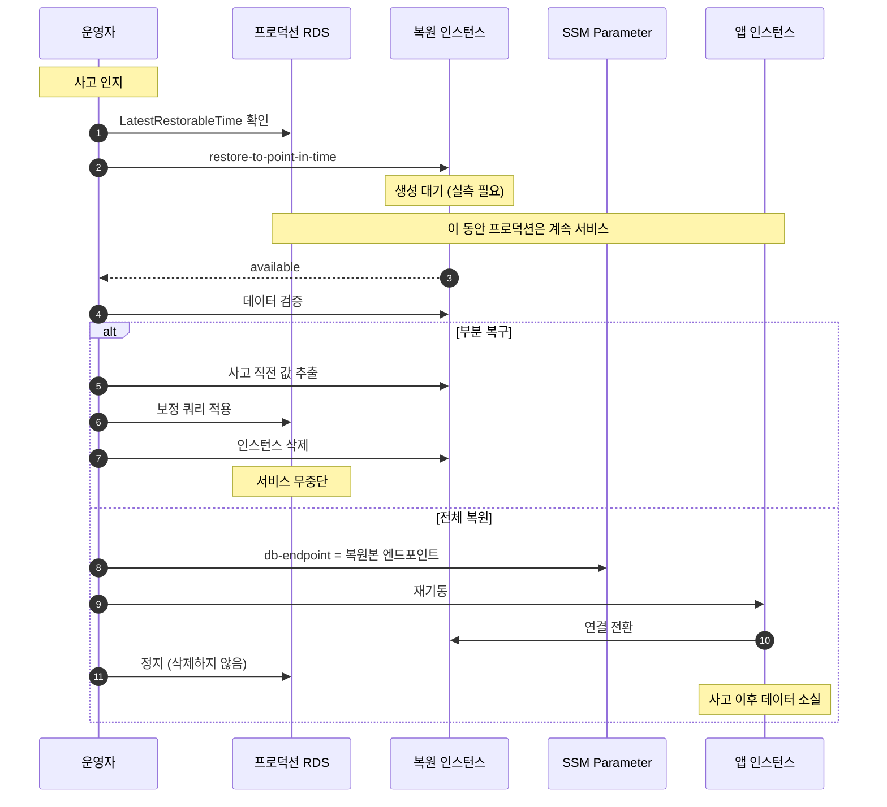

# 백업과 복원 설계 (백엔드 공통)

작성 기준일: 2026-08-02
적용 대상: RDS MySQL 8.4 Multi-AZ
관련 문서: [백엔드공통_장애대응목표와_아키텍처결정.md](./백엔드공통_장애대응목표와_아키텍처결정.md), [백엔드공통_앱과DB_장애대응구조.md](./백엔드공통_앱과DB_장애대응구조.md), [백엔드공통_기술스택_확정문서.md](./백엔드공통_기술스택_확정문서.md), [백엔드공통_알람과알림_설계.md](./백엔드공통_알람과알림_설계.md)

---

## 1. 왜 별도 문서인가

앱과 DB 장애 대응 구조 문서와 다루는 축이 다르다.

| 축 | 앱과 DB 장애 대응 | 백업과 복원 |
|---|---|---|
| 막는 대상 | 가용성 장애 | 정합성 장애 |
| 고장 원인 | 인프라 (인스턴스, 노드, 페일오버) | 사람과 코드 |
| 대응 방식 | 설정으로 자동 처리 | 절차와 사람의 판단 |
| 발동 조건 | 시스템이 감지 | 사람이 결정 |
| RTO | 30초~2분 | 60분 (목표) |
| RPO | 0 | 5분 |

**Multi-AZ는 이 영역을 지켜 주지 못한다.** 스탠바이는 페일오버 전용이라 읽기도 받지 않는다. 프라이머리가 죽어도 데이터는 보존되지만, `WHERE` 절을 빠뜨린 UPDATE는 스탠바이에도 그대로 복제된다. 잘못된 배치가 재고를 두 번 복원해도 마찬가지다. **동기 복제는 오류까지 충실히 복제한다.**

즉 이중화가 구조적으로 막을 수 없는 유일한 부류이며, 그래서 별도의 방어선이 필요하다.

---

## 2. 위협 모델

지켜야 할 대상을 먼저 정한다.

| 위협 | 예시 | 이중화로 막히나 | 백업으로 막히나 |
|---|---|---|---|
| 인스턴스 소실 | 하드웨어 장애 | **막힘** | 불필요 |
| AZ 소실 | 가용영역 장애 | **막힘** | 불필요 |
| 잘못된 DML | `WHERE` 누락 UPDATE, DELETE | 못 막음 | **막힘** |
| 잘못된 배치 | 누적 연산 중복 실행 | 못 막음 | **막힘** |
| 잘못된 마이그레이션 | 컬럼 삭제, 타입 변경 | 못 막음 | **막힘** |
| 애플리케이션 버그 | 잘못된 금액 계산이 누적 | 못 막음 | 부분적 |
| 리전 소실 | 리전 전체 장애 | 못 막음 | **못 막음** (범위 밖) |

**애플리케이션 버그가 가장 까다롭다.** 사고 시점이 명확한 DML 실수와 달리, 버그는 언제부터 잘못된 값이 쌓였는지 알기 어렵다. 이 경우 복원 지점을 특정할 수 없어 전체 롤백이 불가능하고, 6절의 부분 복구 방식을 써야 한다.

---

## 3. 백업 구성

### 3.1 설정

| 항목 | 값 | 근거 |
|---|---|---|
| 자동 백업 보존 기간 | **확정 7일. 현재 1일** | PITR 가능 범위. 최대 35일까지 설정 가능 |
| 백업 창 | 18:00-19:00 UTC (KST 새벽 3시) | **Multi-AZ 라 스탠바이에서 백업을 뜬다.** 프라이머리의 I/O 에 주는 영향이 그만큼 작다 |
| 수동 스냅샷 | 주요 마이그레이션 직전 | 자동 백업과 달리 인스턴스를 지워도 남는다 |
| 스냅샷 보존 | 명시적으로 삭제할 때까지 | 비용은 저장량 기준 |

**현재 보존 기간이 확정값과 다르다.** 프리 티어 `FREE` 플랜이 7일을 거부한다.

```
FreeTierRestrictionError: The specified backup retention period exceeds
the maximum available to free tier customers. To remove all limitations,
upgrade your account plan.
```

`terraform.tfvars` 에서 1일로 낮춰 두었고 코드의 기본값은 7 그대로다. 유료 플랜으로 올릴 때 그 한 줄을 지운다.

**그동안 복구 범위가 하루다.** 사고를 당일에 발견하면 되돌릴 수 있으나, 며칠 뒤에 알아차리는 부류(6절의 애플리케이션 버그 누적)는 지금 구성으로 커버되지 않는다. 8절의 정합성 검증 배치가 그만큼 더 중요해진다.

**수동 스냅샷과 자동 백업의 차이가 중요하다.** 자동 백업은 DB 인스턴스가 삭제되면 함께 사라진다. 인스턴스를 지우게 될 가능성이 있는 작업(파괴 방식 운용, 구성 대규모 변경) 전에는 반드시 수동 스냅샷을 남긴다.

### 3.2 마이그레이션 전 스냅샷

파괴적이지 않은 DDL이라도 데이터 변형을 동반하는 마이그레이션은 스냅샷을 먼저 뜬다.

```bash
aws rds create-db-snapshot \
  --db-instance-identifier "$DB_ID" \
  --db-snapshot-identifier "${DB_ID}-premigration-$(date +%Y%m%d%H%M)"
```

무중단 배포 문서 8.1절의 확장 후 축소 규칙은 롤백 가능성을 지키기 위한 것이고, 이 스냅샷은 그 규칙이 지켜지지 않았을 때의 마지막 수단이다. 두 겹 모두 필요하다.

**부수 효과로 PITR 복원도 빨라진다.** PITR 복원 시간은 기준 스냅샷 이후 재생할 트랜잭션 로그 양에 좌우되는데, 수동 스냅샷이 그 기준점을 사고 직전으로 당겨 준다. 마이그레이션 직후는 복원이 필요해질 확률이 가장 높은 구간이라 효과가 겹친다.

---

## 4. 백업 검증: 존재가 아니라 복원 가능성

**백업은 존재 여부가 아니라 복원 성공 여부로 판정한다.** 콘솔에서 스냅샷 목록이 보이는 것은 아무것도 보장하지 않는다.

FMEA 초안에서 "복원 불가"가 RPN 50으로 상위에 올랐던 이유가 이것이다. 백업은 있는데 복원이 안 되는 상태는 백업이 없는 것과 같고, 그 사실을 사고 당일에 알게 된다.

### 4.1 두 가지 검증

| 검증 | 주기 | 확인 대상 |
|---|---|---|
| 백업 생성 확인 | 매일 | 최신 자동 백업이 24시간 이내인가 |
| 복원 리허설 | 주 1회 | 실제로 복원되고 데이터가 온전한가 |

첫 번째는 자동화한다. 백업이 며칠간 실패했는데 아무도 모르는 상황을 막는다.

```bash
LATEST=$(aws rds describe-db-instances \
  --db-instance-identifier "$DB_ID" \
  --query 'DBInstances[0].LatestRestorableTime' --output text)
```

`LatestRestorableTime`이 현재 시각에서 크게 벌어져 있으면 백업 파이프라인에 문제가 있다는 신호다. 이 값을 CloudWatch 알람으로 감시한다.

### 4.2 복원 리허설

두 번째가 본 문서의 핵심이다. 6절의 절차를 실제로 수행하고 소요 시간을 기록한다. 리허설도 시험에 해당하므로 착수 전에 기술 스택 문서 부록 A.9의 점검을 거친다.

| 측정 항목 | 목표 | 비고 |
|---|---|---|
| 복원 인스턴스 생성 시간 | - | **실측 필요. 목표치 60분의 근거** |
| 데이터 검증 소요 | - | 실측 필요 |
| 엔드포인트 전환 소요 | - | 실측 필요 |
| 실제 RPO | 5분 이내 | 복원 지점과 사고 시점의 차이 |

**RTO 60분은 근거 없는 목표치다.** 실측한 적이 없으며, RDS PITR 복원 시간은 데이터 크기와 마지막 자동 스냅샷 이후 쌓인 트랜잭션 로그 양에 따라 달라진다. 첫 리허설 후 이 값을 실제 수치로 갱신한다.

**RPO 5분은 성격이 다르다.** RDS가 트랜잭션 로그를 5분마다 S3에 업로드하므로 복원 가능한 최신 시점(`LatestRestorableTime`)이 보통 현재 시각에서 5분 이내다. 우리가 정한 목표가 아니라 서비스 구조에서 나오는 값이라 리허설로 바뀌지 않는다. 리허설에서 볼 것은 이 값의 타당성이 아니라 **실제 복원 지점이 5분 안에 들어오는지**다.

#### 측정 조건을 수치와 함께 기록한다

조건이 빠진 수치는 다음 측정과 비교할 수 없다.

| 기록 항목 | 이유 |
|---|---|
| 복원 시점의 데이터 크기 | 복원 시간이 여기에 비례한다 |
| 마지막 자동 스냅샷 이후 경과 시간 | 재생할 로그 양을 좌우한다 |
| 인스턴스 클래스 | I/O 처리량이 복원 속도를 가른다 |

**가장 불리한 시점에 잰다.** 백업 창 직전이 마지막 스냅샷에서 가장 멀어진 시점이라 재생할 로그가 가장 많다. 유리한 시점에 재 두면 정작 사고 때 목표를 넘긴다.

**지금 재는 것은 의미가 없다.** DB가 사실상 비어 있어 복원이 빠를 수밖에 없다. 첫 유효한 측정은 부하 시험으로 데이터가 쌓인 뒤다. 데이터가 늘면 다시 잰다.

---

## 5. 복원이 만드는 구조적 문제: 엔드포인트가 바뀐다

**RDS는 제자리 복원을 지원하지 않는다.** PITR이든 스냅샷 복원이든 항상 **새 인스턴스**를 만든다. 따라서 복원이 끝나도 애플리케이션은 여전히 옛 인스턴스를 보고 있다.

```
사고 발생
  -> 복원 실행
  -> 새 인스턴스 생성 (엔드포인트가 다름)
  -> 애플리케이션이 여전히 옛 인스턴스에 연결   <- 여기가 문제
```

### 5.1 해결: DB 엔드포인트를 SSM에 둔다

무중단 배포 문서 4절에서 현재 이미지 태그를 SSM에 둔 것과 같은 패턴이다.

```bash
# 시작 템플릿의 user-data
DB_ENDPOINT=$(aws ssm get-parameter --name "/${PROJECT}/db-endpoint" \
  --query 'Parameter.Value' --output text)
export DB_ENDPOINT
docker compose up -d
```

복원 후 SSM 값을 새 엔드포인트로 갱신하고 앱을 재기동하면 전환이 끝난다. 이 장치가 없으면 시작 템플릿이나 컨테이너 환경 변수를 직접 고쳐야 하고, 복원 시간에 그만큼이 더해진다.

**대안으로 Route 53 CNAME을 쓸 수도 있다.** DB 엔드포인트를 가리키는 프라이빗 호스팅 영역 레코드를 두고 앱이 그 이름으로 접속하는 방식이다. 다만 JVM DNS 캐시와 TTL 문제가 다시 등장하므로, 이미 SSM 패턴을 쓰고 있는 이상 SSM 쪽이 단순하다.

### 5.2 옛 인스턴스를 지우지 않는다

복원 후에도 사고가 난 원본 인스턴스를 즉시 삭제하지 않는다. 이유는 두 가지다.

1. 복원본에 문제가 있으면 돌아갈 곳이 필요하다
2. **사고 이후 유입된 정상 데이터가 원본에만 있다** (6절 참조)

원본은 정지시켜 두고, 사후 처리가 끝난 뒤 수동 스냅샷을 남기고 삭제한다.

---

## 6. 가장 어려운 문제: 사고 이후 유입된 데이터

전체 복원이 실무에서 잘 쓰이지 않는 이유가 여기 있다.

```
14:00  잘못된 배치가 실행되어 재고가 어긋남
14:00~16:00  정상 주문 300건이 정상적으로 처리됨
16:00  사고 인지
```

13시 55분으로 전체 복원하면 재고는 정상으로 돌아오지만 **정상 주문 300건이 사라진다.** 사고를 고치려다 더 큰 사고를 만드는 셈이다.

### 6.1 부분 복구 방식

전체 복원 대신 다음 절차를 쓴다.

```
1. 복원 인스턴스를 옆에 세운다 (프로덕션은 계속 서비스)
2. 복원본에서 사고 직전의 올바른 값을 추출한다
3. 프로덕션에 보정 쿼리를 적용한다
4. 복원 인스턴스를 삭제한다
```

프로덕션은 멈추지 않고, 사고 이후 데이터도 보존된다.

```sql
-- 2번: 복원본에서 사고 직전 값을 추출
SELECT id, quantity FROM resource_pool WHERE updated_at < '2026-08-02 14:00:00';

-- 3번: 프로덕션에 보정. 사고 이후 정상 변동분을 반영해야 한다
UPDATE resource_pool p
JOIN restored_snapshot r ON r.id = p.id
   SET p.quantity = r.quantity + p.delta_since_incident
 WHERE p.id IN (...);
```

**3번이 어렵다.** 사고 이후의 정상 변동분을 계산해야 하는데, 이게 가능하려면 변경 이력이 남아 있어야 한다. `status_history` 같은 이력 테이블이나 이벤트 로그가 있으면 재계산할 수 있고, 없으면 사실상 불가능하다.

### 6.2 설계에 미치는 요구사항

부분 복구가 가능하려면 **누적 값에 변경 이력이 있어야 한다.** 현재 값만 저장하는 설계는 복구 선택지를 스스로 없앤다.

| 설계 | 부분 복구 |
|---|---|
| 수량 컬럼만 저장 | **불가능.** 전체 롤백만 가능 |
| 수량 + 변경 이력 테이블 | 가능. 이력에서 재계산 |

이 요구사항은 백업 설계가 아니라 도메인 스키마 설계에 속한다. 누적 연산이 있는 테이블에는 이력을 함께 남긴다.

### 6.3 전체 복원을 쓰는 경우

부분 복구가 항상 나은 것은 아니다. 다음 경우는 전체 복원이 맞다.

| 상황 | 이유 |
|---|---|
| 사고 직후 즉시 인지 | 유입 데이터가 거의 없음 |
| 손상 범위가 광범위 | 보정 쿼리를 신뢰할 수 없음 |
| 스키마 자체가 깨짐 | 보정 대상이 아님 |

---

## 7. 복원 절차

### 7.1 PITR 절차

```
 1. 서비스 영향 판단 -> 중단 여부 결정
 2. 복원 지점 결정 (사고 직전, LatestRestorableTime 확인)
 3. 새 인스턴스로 복원 실행
 4. 복원 완료 대기                              [실측 필요]
 5. 복원본 데이터 검증
 6. 전체 복원인가 부분 복구인가 결정 (6절)
 7a. 전체: SSM db-endpoint 갱신 -> 앱 재기동
 7b. 부분: 보정 쿼리 적용 -> 복원본 삭제
 8. 검증
 9. 원본 인스턴스 정지 (삭제하지 않음)
10. 사후 기록
```

```bash
# 3번
aws rds restore-db-instance-to-point-in-time \
  --source-db-instance-identifier "$DB_ID" \
  --target-db-instance-identifier "${DB_ID}-restore-$(date +%Y%m%d%H%M)" \
  --restore-time "2026-08-02T13:55:00Z" \
  --db-subnet-group-name "$SUBNET_GROUP" \
  --vpc-security-group-ids "$DB_SG"
```

**복원 인스턴스는 Single-AZ로 만든다.** 검증용이므로 이중화가 필요 없고, Multi-AZ로 만들면 생성 시간과 비용이 두 배가 된다. 전체 복원으로 전환하기로 결정한 뒤에 Multi-AZ로 수정한다.

### 7.2 복원 시퀀스



**부분 복구 경로에서는 프로덕션이 멈추지 않는다.** 이것이 두 경로의 가장 큰 차이다.

---

## 8. 감지: 복원 절차보다 앞선 문제

복원 절차가 완벽해도 **사고를 감지하지 못하면 소용이 없다.** 며칠 뒤에 발견하면 그때는 정상 거래가 쌓여 부분 복구도 어려워진다.

누적 값 오차는 발생 시점에 아무 신호도 내지 않는다.

```
14:00  배치 중복 실행으로 수량이 +3 부풀려짐
14:00  오류 없음. 예외 없음. 로그 정상
       ... 며칠간 정상 거래 계속 ...
17:20  그 3개를 소비하려는 요청이 실패
17:20  "재고 부족" 오류  <- 원인을 가리키지 않는 증상
```

**사고와 증상 사이의 시간차가 곧 복구 난이도다.** 1시간 뒤에 알면 유입분이 적어 부분 복구가 쉽고, 사흘 뒤에 알면 되돌릴 방법이 사실상 없다.

FMEA 초안에서 "누적 값 정합성 훼손"이 RPN 50으로 상위에 오른 이유가 감지 수단이 아예 없어서였다.

### 8.1 정합성 검증 배치

누적 값을 원장에서 재계산해 현재 값과 대조한다.

```sql
-- 이력에서 재계산한 값과 현재 값을 비교한다
SELECT p.id,
       p.quantity                          AS current_quantity,
       COALESCE(SUM(h.delta), 0)           AS calculated_quantity,
       p.quantity - COALESCE(SUM(h.delta), 0) AS diff
FROM resource_pool p
LEFT JOIN resource_history h ON h.resource_id = p.id
GROUP BY p.id, p.quantity
HAVING diff <> 0;
```

0행이 아니면 알람을 낸다. **알람 메시지에는 오차 건수와 최대 오차뿐 아니라 해당 레코드의 최근 변경 시각과 변경 주체를 함께 싣는다.** 사고 시점과 원인을 추정하는 1차 정보가 되어 9절 런북의 0단계를 즉시 시작할 수 있다.

```sql
-- 알람 메시지용 요약. 최근 변경 정보를 함께 조회한다
SELECT COUNT(*)                          AS mismatch_count,
       MAX(ABS(d.diff))                  AS max_diff,
       MAX(h.changed_at)                 AS last_changed_at,
       GROUP_CONCAT(DISTINCT h.changed_by) AS changed_by
FROM (/* 위 검증 쿼리 */) d
JOIN resource_history h ON h.resource_id = d.id;
```

어긋난 레코드들의 최근 변경이 전부 같은 시각의 `BATCH`라면 원인이 배치라는 것이 즉시 드러난다. 주기는 도메인에 따라 다르지만, **사고 인지가 늦을수록 복구가 어려워지므로 짧을수록 좋다.** 시간당 1회를 출발점으로 하고 부하를 보며 조정한다.

이 배치도 배치 설계 문서의 규칙을 따른다. 읽기 전용이라 다시 돌아도 무해한 재계산형이다.

### 8.2 감지가 불가능한 경우

이력이 없는 테이블은 재계산 대상이 없어 검증할 수 없다. 6.2절에서 말한 스키마 요구사항이 여기서도 같은 결론에 도달한다. **누적 값에는 이력을 남긴다.**

---

## 9. 런북

사고 시 판단해야 할 것을 미리 정해 둔다. 사고 중에 처음 고민하면 시간이 배로 든다.

### 9.1 판단 흐름

#### 0단계: 원인 차단이 먼저다

**복원이나 보정에 손대기 전에 손상이 계속 확대되고 있는지부터 확인한다.**

| 질문 | 확인 방법 | 조치 |
|---|---|---|
| 잘못된 배치가 돌고 있는가 | 배치 실행 로그, 최근 변경 주체 | 스케줄러 중지 |
| 최근 배포가 원인인가 | 배포 시각과 오차 발생 시각 대조 | 이전 SHA로 롤백 |
| 수동 조작이 있었는가 | 감사 로그 | 접근 차단 |

원인이 살아 있는 상태에서 복원하면 **복원본도 곧 같은 방식으로 오염된다.** 배치를 멈추지 않고 재고를 되돌리면 다음 주기에 다시 어긋난다.

이 단계에서 서비스를 멈출지도 함께 판단한다. 손상이 확대 중이고 원인 차단이 어려우면 중단이 정답일 수 있다.

#### 1단계: 복구 방식 판단

원인을 차단한 뒤에 방식을 정한다.

| 질문 | 판단 |
|---|---|
| 사고 시점을 특정할 수 있는가 | 못 하면 전체 복원 불가. 부분 복구만 가능 |
| 사고 이후 정상 데이터가 있는가 | 있으면 부분 복구 우선 검토 |
| 변경 이력이 남아 있는가 | 없으면 부분 복구 불가 |
| 손상 범위가 광범위한가 | 넓으면 보정 쿼리를 신뢰하기 어려움 |

세 질문에 모두 "예"면 부분 복구, 하나라도 "아니오"면 전체 복원을 검토한다. 상세 기준은 6.3절에 있다.

### 9.2 기록 항목

사후에 반드시 남긴다.

| 항목 | 이유 |
|---|---|
| 사고 발생 시각과 인지 시각의 차이 | 감지 수단 개선의 근거 |
| 복원 소요 시간 | RTO 목표치 갱신 |
| 실제 데이터 손실 범위 | RPO 목표치 갱신 |
| 부분 복구인가 전체 복원인가 | 절차 개선 |
| 보정 쿼리 전문 | 재발 시 재사용 |

---

## 10. 비용

| 항목 | 과금 |
|---|---|
| 자동 백업 (DB 크기 이내) | 무료 |
| 자동 백업 (DB 크기 초과분) | 저장량 기준 |
| 수동 스냅샷 | 저장량 기준 |
| 복원 인스턴스 | 존재하는 동안 인스턴스 시간 + 스토리지 |

**복원 리허설의 비용은 복원 인스턴스를 얼마나 오래 두느냐에 달렸다.** db.t4g.micro Single-AZ를 2시간 쓰면 약 0.04 USD다. 주 1회 리허설로 월 0.2 USD 수준이라 무시할 만하다.

리허설 후 인스턴스 삭제를 잊으면 월 15 USD가 추가된다. 삭제까지 스크립트에 포함시킨다.

---

## 11. 실패 모드

| 실패 모드 | 결과 | 안전장치 |
|---|---|---|
| 백업이 며칠간 실패 | 복원 불가 | `LatestRestorableTime` 알람 |
| 백업은 있으나 복원 실패 | 사고 당일에 발견 | 주 1회 복원 리허설 |
| 사고를 며칠 뒤 인지 | 부분 복구도 어려워짐 | 정합성 검증 배치 |
| 이력이 없어 부분 복구 불가 | 전체 복원만 가능, 정상 데이터 소실 | 누적 값에 이력 필수 |
| 복원 후 엔드포인트 미갱신 | 옛 인스턴스에 계속 연결 | SSM `db-endpoint` 패턴 |
| 원인 차단 전에 복원 | 복원본도 오염 | 런북 0단계 |
| 알람만 보고 시점을 추정 | 사고 시점 오판, 잘못된 복원 지점 | 알람에 최근 변경 시각 포함 |
| 원본을 즉시 삭제 | 사고 이후 데이터 영구 소실 | 정지만 하고 보존 |
| 리허설 인스턴스 삭제 누락 | 월 15 USD 추가 | 스크립트에 삭제 포함 |
| 인스턴스 삭제로 자동 백업 소실 | 복원 불가 | 삭제 전 수동 스냅샷 |

---

## 12. 범위 밖

| 항목 | 사유 |
|---|---|
| 리전 소실 대응 | 교차 리전 백업 복제가 필요. 예산과 검증 가능성 밖 |
| 논리적 백업 (mysqldump) | PITR로 충분. 대용량에서 복원이 더 느림 |
| 캐시 데이터 백업 | Degradable 등급. 원본에서 재생성 |
| 관측 데이터 백업 | 실험 결과는 S3로 내보내기. 별도 절차 |

---

## 13. 미확정 항목

| 항목 | 확정 시점 |
|---|---|
| RTO 실측치 (현재 목표 60분) | 첫 복원 리허설. 데이터가 쌓인 뒤 |
| 실제 복원 지점이 5분 안에 드는지 | 첫 복원 리허설 |
| 정합성 검증 배치 주기 | 부하 시험 후 |
| 백업 창 시간대 | 트래픽 패턴 파악 후 |
| SSM `db-endpoint` 패턴 도입 | Terraform 구성 시 |

**RTO 60분은 아직 근거 없는 목표치다.** 리허설 전까지는 이 문서의 모든 시간 계산이 가정에 기대고 있다는 점을 전제로 읽어야 한다. RPO 5분은 4.2절대로 AWS 구조에서 나오는 값이라 여기에 해당하지 않는다.
