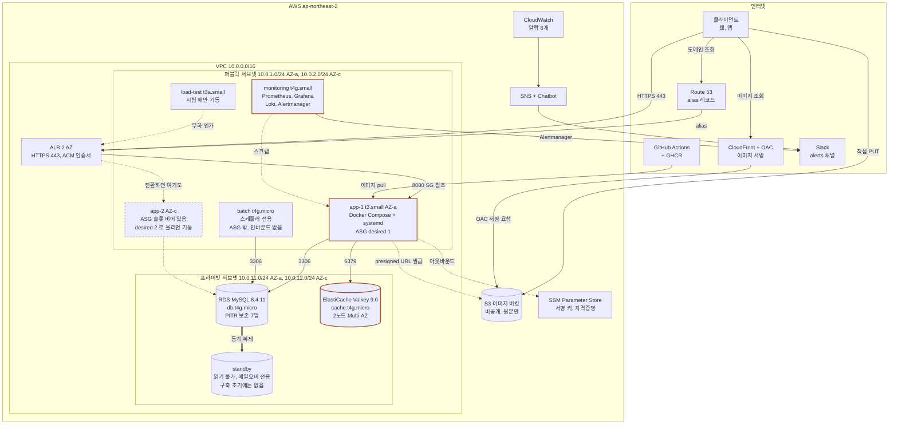
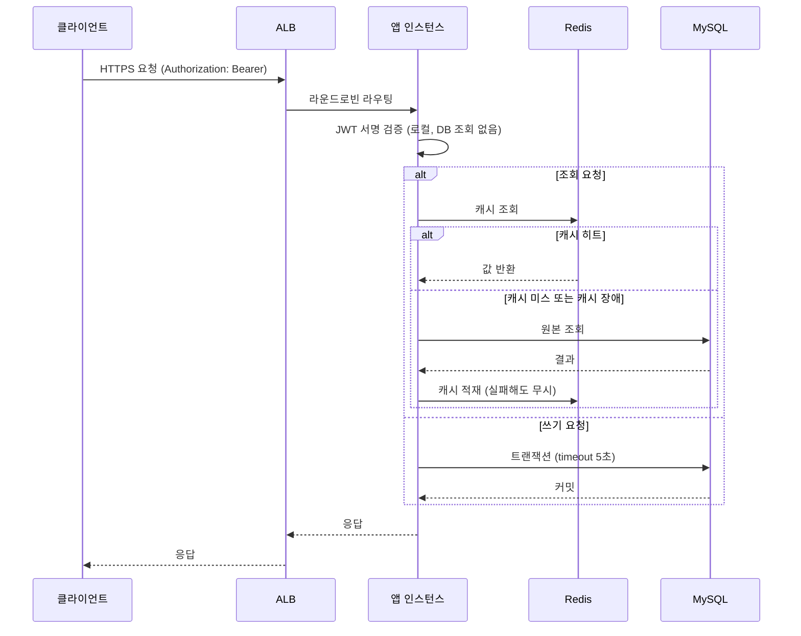
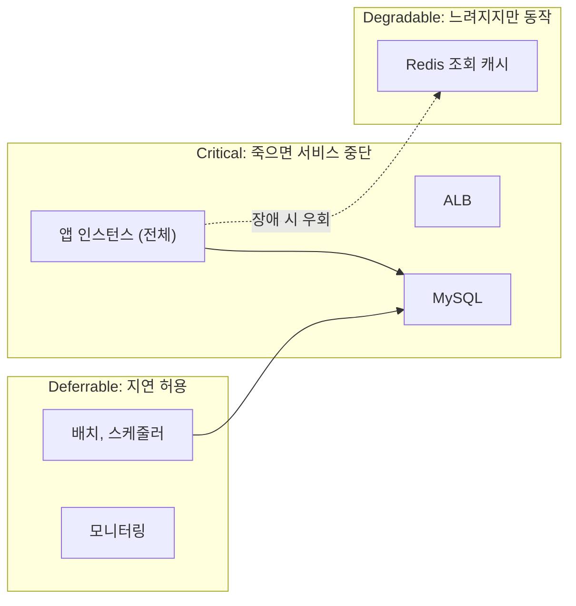
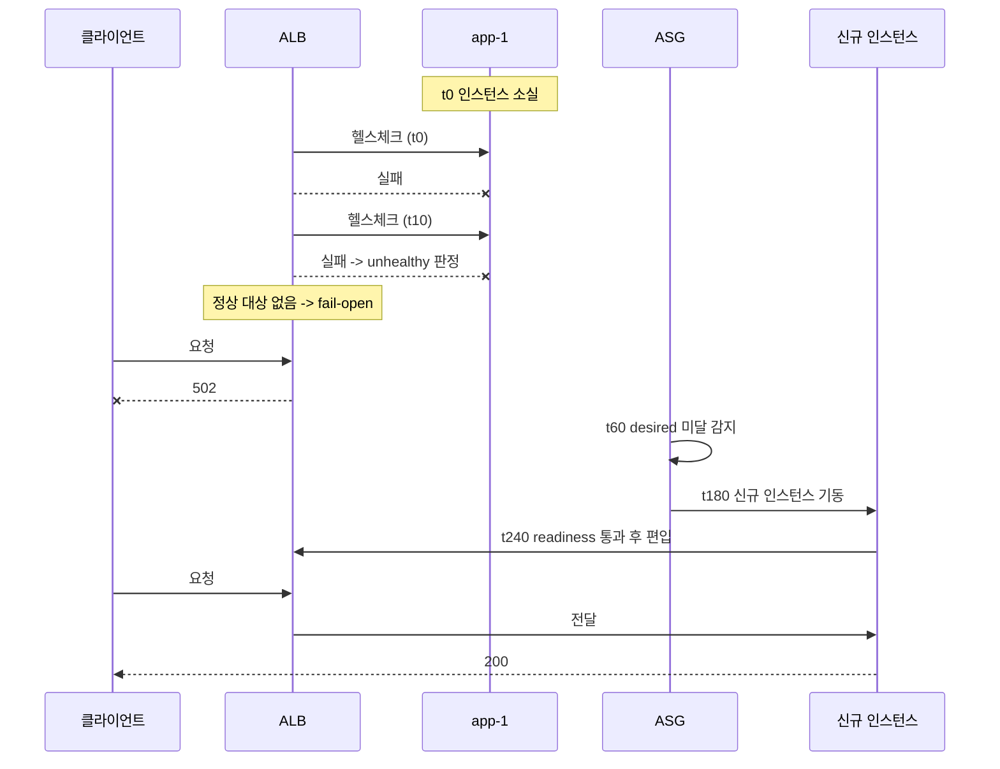
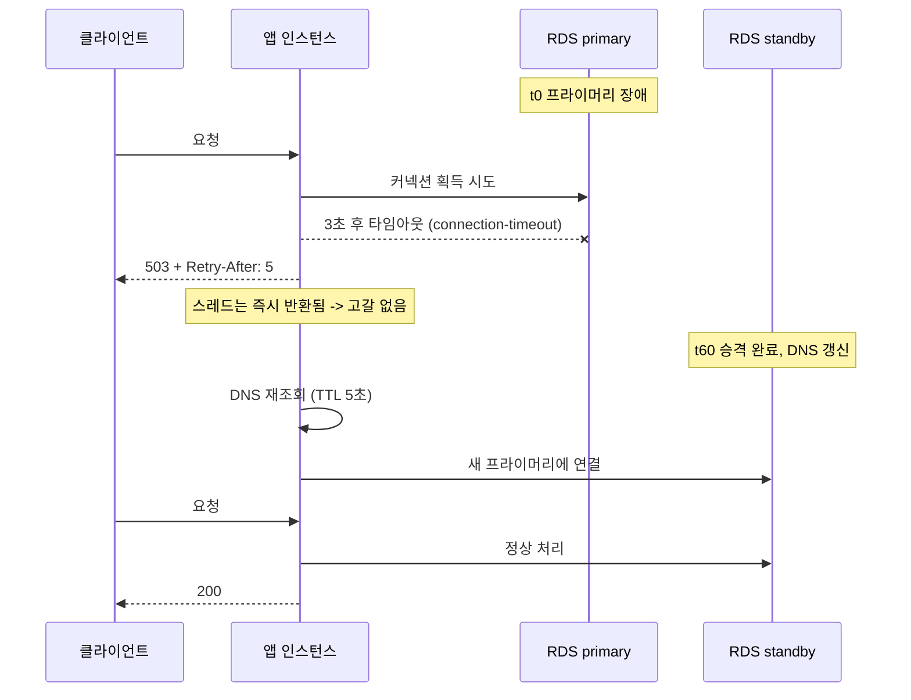
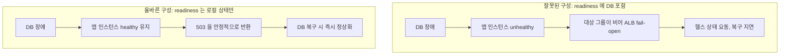
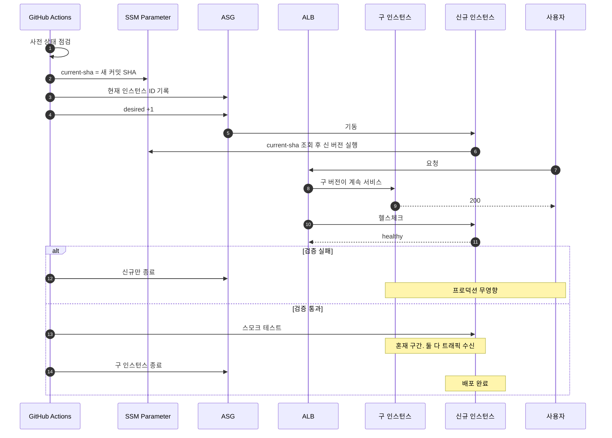
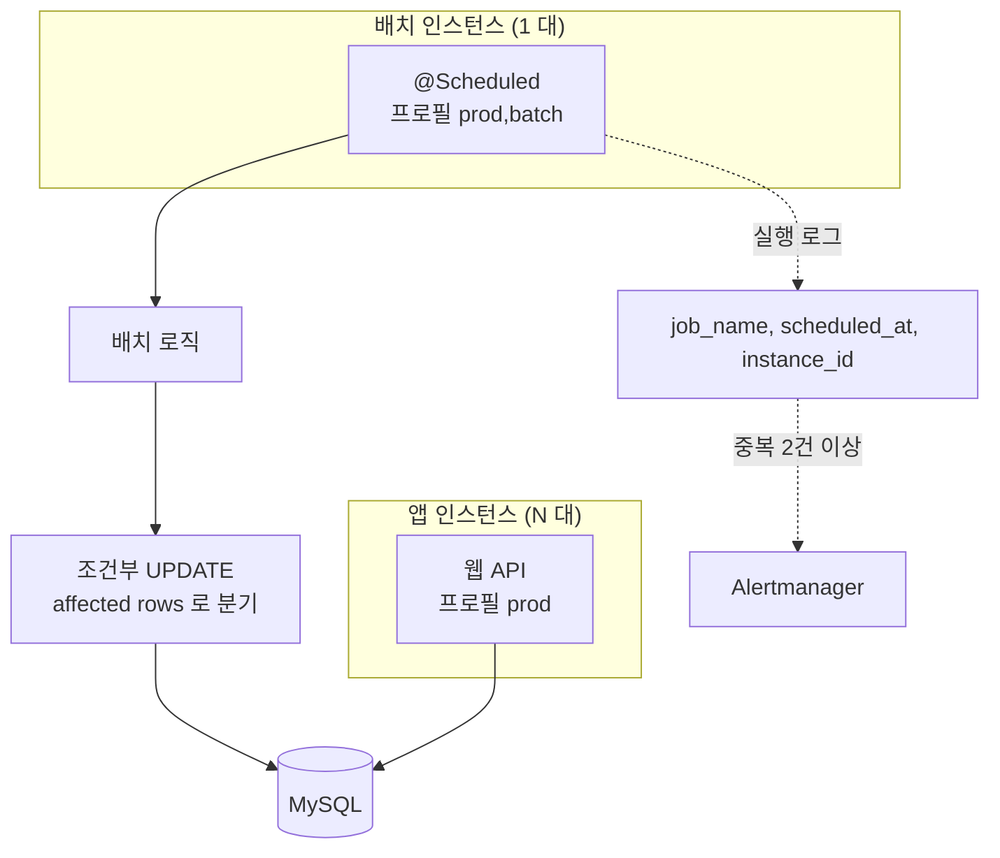
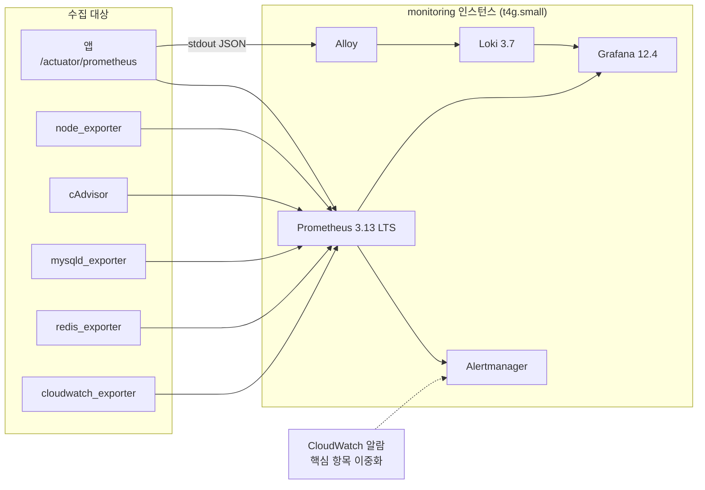
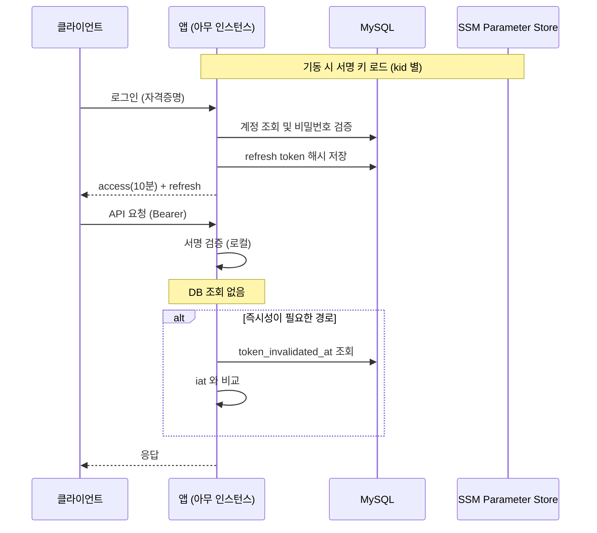

# 시스템 디자인 종합 (백엔드 공통)

작성 기준일: 2026-08-01
현재 상태: 1단계(목표와 아키텍처 결정) 완료, 앱과 DB 장애 대응 구조 확정

---

## 1. 한 장 요약



굵은 테두리로 표시한 셋(앱, 캐시, 모니터링)이 이중화되지 않은 자원이다.
점선으로 둔 `app-2` 는 ASG 에 서브넷만 등록되어 있고 기동하지 않은 슬롯이다.
`desired_capacity` 를 1에서 2로 올리면 켜지며, 인프라 구성 변경은 필요 없다. 전환 후 수치는 장애 대응 목표 문서 4.3절에 있다.

핵심 특징 일곱 가지다.

1. **앱은 트래픽에 따라 1~3 대로 움직인다** (2026-08-29 오토스케일링 전환). 한산할 때 1대로 내려가므로 **그 구간에서는 앱이 여전히 단일 장애점이다.** 확장이 걸려 있는 동안에만 해소된다.
2. **앱은 상태를 갖지 않는다.** JWT stateless 인증이므로 어느 인스턴스가 죽어도 사용자가 로그아웃되지 않고, 인스턴스를 자유롭게 교체할 수 있다.
3. **DB와 캐시가 이중화되어 있다.** 캐시는 primary AZ-a + 복제본 AZ-c 이고 자동 페일오버를 켰다 (`INF-37`). 다만 등급은 Degradable 그대로라 캐시가 통째로 비는 경우의 강등 경로는 유지한다.
4. **NAT Gateway가 없다.** 앱이 퍼블릭 서브넷에 있고, 인바운드는 ALB 보안 그룹으로만 제한한다.
5. **이미지는 앱을 거치지 않는다.** 업로드는 presigned URL 로 클라이언트가 S3 에 직접 넣고, 조회는 CloudFront 가 OAC 로 비공개 버킷을 대신 읽는다. 앱의 대역폭과 메모리를 쓰지 않는다. 근거는 이미지 저장소 설계 문서에 있다.
6. **배포는 인스턴스 교체형 롤링이다.** 신규 인스턴스를 띄워 검증한 뒤 구 인스턴스를 종료한다.
7. **관측은 자체 호스팅이며 알림 경로가 둘이다.** 관리형 대비 약 6배 저렴하고 고해상도 스크랩이 비용을 늘리지 않는다. 다만 모니터링 인스턴스가 죽으면 감지 수단이 사라지므로, 핵심 알람만 CloudWatch 에 이중으로 걸어 두 번째 경로를 만든다.

---

## 2. 네트워크 배치

```
Route 53 호스팅 영역
  api.example.com  --alias-->  ALB

VPC 10.0.0.0/16
│
├── 퍼블릭 서브넷 A (10.0.1.0/24, AZ-a)
│     ├── ALB 노드      SG-alb  : 인터넷에서 오는 443 과 80
│     ├── app-1        SG-app  : SG-alb 에서 8080, SG-alb 와 SG-mon 에서 8081
│     ├── monitoring   SG-mon  : SG-app 과 SG-batch 에서 오는 3100. 관리자 접근은 SSM
│     ├── batch        SG-batch: 인바운드 없음. ALB 에 붙지 않는다
│     └── load-test    SG-lt   : 인바운드 없음. 시험 시간에만 기동
│
├── 퍼블릭 서브넷 C (10.0.2.0/24, AZ-c)
│     ├── ALB 노드      SG-alb
│     └── (ASG 서브넷으로 등록. 현재 인스턴스 없음)
│
├── 프라이빗 서브넷 A (10.0.11.0/24, AZ-a)
│     ├── RDS primary  SG-db   : SG-app, SG-batch, SG-mon 에서 오는 3306
│     └── ElastiCache  SG-cache: SG-app, SG-mon 에서 오는 6379
│
└── 프라이빗 서브넷 C (10.0.12.0/24, AZ-c)
      └── RDS standby
```

**AZ-a 와 AZ-c 는 각각 `ap-northeast-2a` 와 `ap-northeast-2c` 다.** AWS 는 계정마다 AZ 이름을 다른 물리 영역에 매핑하므로, 이 값은 이 계정 기준이며 Terraform 에서 변수로 둔다.

**두 요소만 AZ 가 확정값이다.** 모니터링과 배치는 ASG 밖 단독이라 AZ 를 명시적으로 고른다. 나머지는 다르다.

| 요소 | AZ | 왜 |
|---|---|---|
| monitoring | **AZ-a 고정** | ASG 밖. EBS 에 관측 데이터가 쌓여 옮길 수 없다 (`INF-24`) |
| batch | **AZ-a 고정** | ASG 밖 단독. RDS primary 와 같은 AZ 라 크로스 AZ 전송이 준다 |
| load-test | AZ-a | 시험 시간에만 뜨므로 가용성과 무관 |
| **app** | **고정하지 않는다** | ASG 가 2 AZ 서브넷 중에 고른다. AZ-a 는 현재 관측값이지 확정값이 아니다 |
| **RDS** | **고정하지 않는다** | 페일오버로 primary 와 standby 가 뒤바뀐다 |
| ElastiCache | primary 는 AZ-a 선호 | 서브넷 그룹에는 두 AZ 를 모두 등록한다 |

app 과 RDS 의 AZ 를 코드에 박으면 안 된다. 앱은 AZ 소실 시 다른 AZ 로 재기동하는 것이 "AZ 1개 소실 RTO 5분"(4.1절)을 성립시키는 구조이고, RDS 는 페일오버가 그 값을 뒤집는다.

앱을 퍼블릭 서브넷에 두는 이유는 NAT Gateway를 쓰지 않기 위해서다. NAT는 시간당 요금과 데이터 처리 요금이 이중으로 붙어 월 40 USD를 넘는데, 이는 전체 예산의 4분의 1이다.

보안은 서브넷이 아니라 보안 그룹으로 확보한다. 앱 인스턴스는 퍼블릭 IP를 갖지만, 인바운드 규칙이 ALB 보안 그룹 출처만 허용하므로 외부에서 직접 접근할 수 없다. 운영 접근은 22번 포트가 아니라 SSM Session Manager로 처리한다.

| 통신 | 허용 방식 |
|---|---|
| 클라이언트 -> Route 53 | 도메인 조회 |
| 인터넷 -> ALB | 443 (80은 443으로 리다이렉트) |
| ALB -> 앱 (트래픽) | 보안 그룹 참조로 8080 |
| ALB -> 앱 (헬스체크) | 보안 그룹 참조로 8081 |
| 앱 -> RDS | 보안 그룹 참조로 3306 |
| 앱 -> 캐시 | 보안 그룹 참조로 6379 |
| 배치 -> RDS | 보안 그룹 참조로 3306 |
| 모니터링 -> 앱 | 보안 그룹 참조로 8081. 익스포터 포트는 9장 |
| 모니터링 -> RDS | 보안 그룹 참조로 3306. `mysqld_exporter` |
| 모니터링 -> 캐시 | 보안 그룹 참조로 6379. `redis_exporter` |
| 부하 생성 -> ALB | 443 |
| 앱, 배치, 모니터링 -> GHCR, SSM | 아웃바운드 인터넷 |
| 운영자 -> 인스턴스 | SSM Session Manager (포트 미개방) |

**허용 출처가 앱 하나가 아니다.** 위 배치도가 `SG-db` 를 "app SG 에서 오는 3306 만" 으로 적었는데, 그것만 열면 배치가 아무 일도 못 하고 `mysqld_exporter` 가 붙지 못해 관측이 통째로 죽는다. 실제 출처는 이렇다.

```
SG-alb    인바운드 443, 80  <- 인터넷
SG-app    인바운드 8080     <- SG-alb                     트래픽
          인바운드 8081     <- SG-alb, SG-mon             액추에이터
          인바운드 9100     <- SG-mon                     node_exporter
          인바운드 8082     <- SG-mon                     cAdvisor
SG-batch  인바운드 8081, 9100, 8082  <- SG-mon            같은 이유
SG-db     인바운드 3306     <- SG-app, SG-batch, SG-mon
SG-cache  인바운드 6379     <- SG-app, SG-mon
SG-mon    인바운드 3100     <- SG-app, SG-batch          Alloy 로그 전송
SG-lt     인바운드 없음
```

**`node_exporter` 와 `cAdvisor` 는 앱과 배치 인스턴스에도 뜬다.** 그 호스트의 CPU 크레딧과 컨테이너 상태를 봐야 하므로 모니터링이 각 인스턴스로 긁으러 간다. 포트는 `observability/README.md` 가 정한다. cAdvisor 기본값 8080 은 앱과 겹쳐 8082 로 옮겼다.

**액추에이터를 8081 로 분리했다.** 8080 에는 `/actuator` 경로가 존재하지 않으므로 밖에서 막을 규칙이 없다. 규칙으로 막는 방법도 있으나 규칙 하나가 지워지면 그대로 열린다.

대상 그룹은 둘이다.

| 대상 그룹 | 트래픽 포트 | 헬스체크 | 쓰는 곳 |
|---|---|---|---|
| `app` | 8080 | 8081 `/actuator/health/readiness` | 기본 동작 |
| `liveness` | 8081 | 8081 `/actuator/health/liveness` | Route 53 헬스체크 경로 하나 |

Route 53 은 AWS 밖에서 찌르므로 그 경로만 리스너 규칙으로 8081 에 보낸다. **이 규칙이 지워지면 외부 감시가 실패해 알람이 울린다.** 액추에이터가 열리는 방향으로는 고장 나지 않는다.

**`SG-mon` 의 인바운드는 Loki 하나뿐이다.** 지표 스크랩은 모니터링이 나가는 연결이라 규칙이 필요 없지만, **로그는 방향이 반대다.** Alloy 가 각 인스턴스에서 컨테이너 로그를 읽어 Loki 로 밀어 넣는다. Grafana 화면은 포트를 열지 않고 SSM 포트 포워딩으로 본다. `SG-lt` 는 ALB 에 붙지 않고 외부에서 들어올 일이 없어 비어 있다.

**아웃바운드는 다섯 모두 전체 허용이다.** GHCR 이미지 pull, SSM Parameter Store 조회, 패키지 설치가 인터넷으로 나간다. NAT 가 없어 퍼블릭 서브넷의 인스턴스가 직접 나가고, 프라이빗 서브넷의 RDS 와 캐시는 나갈 일이 없다.

---

## 3. 정상 요청 흐름



**JWT 검증에 DB 조회가 없다는 점이 이 설계의 출발점이다.** 서명만 로컬에서 확인하므로 인증 경로가 DB나 캐시에 의존하지 않는다. 그 대가로 계정 차단이 토큰 만료(10분)까지 지연되며, 즉시성이 필요한 경로에서만 무효화 기준 시각을 조회한다.

캐시 장애 시 원본 조회로 떨어지는 경로가 코드에 명시되어 있어야 한다. 이것이 캐시를 Degradable로 분류할 수 있는 근거다.

---

## 4. 의존성 등급 맵



같은 Redis라도 용도에 따라 등급이 달라진다는 점이 중요하다.

| 용도 | 등급 | 배치 위치 | 근거 |
|---|---|---|---|
| 조회 캐시 | Degradable | Redis | 소실돼도 원본에서 재생성 |
| 세션 | 해당 없음 | 없음 (stateless) | 상태를 없애 등급 자체를 제거 |
| 토큰 무효화 | Critical | MySQL | 소실 시 취소된 토큰이 되살아남 |

캐시 하나를 여러 용도로 겸용하면 가장 높은 등급을 따라간다. 용도를 분리하는 것만으로 이중화 비용을 줄일 수 있다.

---

## 5. 장애 시 동작

### 5.1 앱 인스턴스 소실



| 시점 | 사건 |
|---|---|
| t0 | 인스턴스 소실. 서비스 중단 시작 |
| t10 | 대상 unhealthy 판정. 갈 곳이 없어 502 |
| t240 | 신규 인스턴스 편입. **RTO 목표 5분 달성 지점** |

**앱이 1대이므로 t0부터 t240까지가 그대로 다운타임이다.** 2대로 늘리면 t10에 나머지 인스턴스가 트래픽을 받아 RTO가 30초가 된다.

클라이언트 재시도가 전제이며, 쓰기 요청은 멱등키가 있어야 중복 처리가 생기지 않는다. 1대 구성에서는 재시도해도 복구 전까지 실패하므로 백오프 정책이 더 중요하다.

### 5.2 MySQL 페일오버



**이 흐름의 핵심은 앱이 죽지 않는다는 것이다.** 아무 설정도 없으면 다음처럼 흘러 DB 장애가 앱 장애로 번진다.

```
설정 없음:
  요청 1..200 -> 커넥션 무한 대기 -> 톰캣 스레드 전부 소진
              -> 헬스 엔드포인트조차 응답 불가
              -> ALB가 인스턴스를 죽은 것으로 판정
              -> DB 복구 후에도 대상 그룹 재편입이 지연됨

설정 적용:
  요청 1..200 -> 3초 만에 실패, 스레드 반환
              -> 503 을 안정적으로 반환
              -> 헬스체크는 계속 통과
              -> DB 복구와 동시에 정상화
```

이 차이를 만드는 설정이 네 가지다.

| 설정 | 값 | 막는 것 |
|---|---|---|
| `networkaddress.cache.ttl` | 5 | 옛 주소 고착으로 복구 실패 |
| `socketTimeout` | 10000 | 이미 맺은 커넥션의 무한 대기 |
| Hikari `connection-timeout` | 3000 | 톰캣 스레드 고갈 |
| `@Transactional(timeout)` | 5 | 쿼리 도중 정지 |

### 5.3 헬스체크 설계가 두 장애를 가른다



판단 기준은 단순하다.

| 의존성 성격 | readiness 포함 | 이유 |
|---|---|---|
| 인스턴스 로컬 상태 | 포함 | 이 인스턴스만의 문제라 빼면 해결됨 |
| 공유 의존성 (DB, 캐시, 외부 API) | 제외 | 모든 인스턴스가 동시에 빠져 상황이 악화됨 |

liveness와 readiness의 역할도 다르다.

| 종류 | 질문 | 소비자 | 실패 시 |
|---|---|---|---|
| liveness | 프로세스를 다시 띄워야 하나 | Docker | 컨테이너 재기동 |
| readiness | 트래픽을 보내도 되나 | ALB | 대상 그룹 제외 |

---

## 6. 타임아웃 계층

종료와 대기 시간은 안쪽에서 바깥쪽으로 갈수록 길어야 한다. 하나라도 역전되면 처리 중 요청이 잘린다.

```
종료 타임아웃 (배포와 재기동)

  systemd TimeoutStopSec           60초  ┐
    Docker stop_grace_period       45초  │ 바깥이 더 길다
      Spring graceful shutdown     30초  │
        ALB deregistration delay   30초  ┘

요청 타임아웃 (장애 시 빠른 실패)

  ALB idle timeout                 60초  ┐
    JDBC socketTimeout             10초  │ 안쪽이 더 짧다
      트랜잭션 timeout               5초  │
        Hikari connection-timeout   3초  ┘
```

두 계층의 방향이 반대인 것이 헷갈리기 쉽다. 종료는 "바깥이 안쪽을 기다려 준다"이고, 요청은 "안쪽이 먼저 포기해 바깥을 지킨다"이다.

---

## 7. 배포 흐름



| 항목 | 값 |
|---|---|
| 전환 방식 | 대상 그룹 하나 안에서 인스턴스 교체 |
| 배포 중 용량 | 100% |
| 배포 소요 | 6~8분 |
| 롤백 소요 | 1~2분(종료 전) 또는 6~8분(종료 후) |
| 혼재 구간 | 약 1분 |
| 배포 1회 추가 비용 | 약 0.01 USD |

### 7.1 현재 버전의 진실

롤링은 인스턴스를 유지한 채 컨테이너만 교체하므로 ASG가 배포를 알지 못한다. 시작 템플릿에 태그가 고정되어 있으면 **ASG가 장애로 인스턴스를 교체할 때 구버전이 올라온다.**

현재 버전을 SSM 파라미터에 두고 user-data가 읽게 한다. 배포 스크립트는 컨테이너 교체보다 **먼저** 이 값을 갱신한다.

```bash
CURRENT_SHA=$(aws ssm get-parameter --name "/${PROJECT}/current-sha" \
  --query 'Parameter.Value' --output text)
```

### 7.2 혼재 구간이 강제하는 규칙

약 2분간 서로 다른 버전이 **모두 실제 트래픽을 처리한다.** 배포가 중단되면 이 구간이 무기한 지속된다.

1. **스키마는 확장 후 축소만 허용한다.** CI에서 파괴적 DDL을 차단한다.
2. **API 응답 필드는 추가만 허용한다.** 제거는 클라이언트 전환 후 별도 배포로 한다.
3. **상태 전이는 조건부 UPDATE로 멱등하게 만든다.** 어느 버전이 배치 락을 잡을지 알 수 없다.

### 7.3 부하 시험과의 분리

**부하 시험 중에는 배포하지 않는다.** 용량이 줄어서가 아니다. 신규를 먼저 띄우므로 용량은 100%로 유지된다.

문제는 **측정이 오염된다**는 것이다. 혼재 구간에는 두 버전이 함께 트래픽을 받으므로 그 구간의 지연이 어느 버전 때문인지 구분할 수 없다. 게다가 t3.small 은 버스트 인스턴스라 배포로 인스턴스가 하나 더 뜨면 크레딧 소모가 달라진다. 결과가 앱 문제인지 배포 영향인지 갈리지 않는다.

---

## 8. 배치

주기 실행 스케줄러를 전용 인스턴스 한 대에서 돌린다.



앱과 같은 jar 를 쓰고 `batch` 프로필로만 스케줄러를 켠다. **앱 인스턴스에는 스케줄러가 없으므로
앱을 몇 대로 늘려도 배치는 한 번만 돈다.**

이 구성은 **배치 인스턴스가 한 대이고 무중단 배포를 하지 않는다**는 두 조건에 기대고 있다.
전제가 깨지는 경로는 프로필 설정 실수이며, Terraform 으로 런치 템플릿을 고정해 예방하고
같은 `scheduled_at` 에 시작 로그가 2건 이상이면 경보로 탐지한다.
데이터 손상은 조건부 UPDATE 멱등화가 최종적으로 막는다. 상세는 배치 설계 문서에 있다.


## 9. 관측 구조



모니터링 인스턴스가 단일 장애점이므로, 이것이 죽으면 감지 수단이 사라진다. 보완책으로 핵심 알람만 CloudWatch에 이중 설정한다. CloudWatch 알람은 상시 무료 한도(10개) 안에서 처리한다.

관리형(AMP, AMG, CloudWatch Logs)이 아니라 자체 호스팅을 택한 이유는 두 가지다.

| 이유 | 내용 |
|---|---|
| 비용 | 15초 스크랩 기준 관리형 91~95 USD 대 자체 호스팅 14 USD |
| 구조 | 관리형은 스크랩 해상도를 높일수록 비용이 늘어 장애 관측과 상충 |

장애 검증에는 5~15초 해상도가 필요하다. 60초 간격으로는 30초짜리 사건을 두 점으로밖에 볼 수 없다.

---

## 10. 인증 구조



| 얻는 것 | 치르는 비용 |
|---|---|
| 앱 무상태화, 인스턴스 교체 자유 | 계정 차단이 최대 10분 지연 |
| 스티키 세션 불필요 | refresh 저장소가 결국 상태 |
| 인스턴스 소실에도 로그아웃 없음 | 서명 키가 새 단일 장애점 |
| 캐시를 Critical에서 제외 | 시계 오차가 토큰 검증에 영향 |

서명 키는 `kid` 헤더로 구 키와 신 키를 동시에 허용해 무중단 회전한다. 저장소는 Secrets Manager가 아니라 SSM Parameter Store를 쓴다. 전자는 시크릿당 월 0.40 USD가 붙고 후자는 표준 파라미터가 무료다.

---

## 11. 전체 스펙과 비용

비용 기준은 **한 달 상시 운영**이다. 서울 리전 온디맨드, 월 730시간 환산이다.

| 구성요소 | 스펙 | 월 |
|---|---|---|
| ALB | 1대, 2 AZ | 17.74 USD |
| ALB LCU | 소량 (약 1 LCU) | 5.84 USD |
| 앱 | t3.small x 1~3 | 18.98 ~ 56.94 USD |
| RDS | MySQL 8.4, db.t4g.micro, Multi-AZ | 29.20 USD |
| RDS 스토리지 | gp3 20GB + 백업 | 5 USD |
| 캐시 | ElastiCache Valkey 9.0, cache.t4g.micro 2노드 | 23.36 USD |
| 모니터링 | t4g.small | 15.18 USD |
| EBS | gp3 50GB | 4.56 USD |
| 부하 생성 | t3a.small, 약 40시간 | 0.94 USD |
| CPU 크레딧 초과분 | 부하 시험 구간 | 2 USD |
| Route 53 호스팅 영역 | 1개 | 0.50 USD |
| Route 53 헬스체크 | 엔드포인트 1개, 외부 관점 감시 | 0.50 USD |
| 도메인 등록비 | 월 환산 | 1.20 USD |
| Terraform 상태 S3 | | 0.10 USD |
| 스냅샷, CloudWatch, 전송 | | 10 USD |
| **합계** | | **약 140 ~ 181 USD** |

EC2와 EBS 단가는 서울 리전에서 직접 확인했다. ALB, ElastiCache, RDS는 인접 리전과 us-east-1 값에서 환산한 추정치이며 총액의 약 3분의 1을 차지한다. 확정 전 요금 계산기 검증이 필요하다.

**인프라는 상시 가동을 기본 전제로 한다.** 리소스는 종료되지 않으며, 비용도 이 기준으로 산정한다.

가동 시간을 줄이는 방안(중지, 파괴)은 기술 스택 문서 부록 A에 정리했으며, **운영자가 스크립트로 명시적으로 실행하는 예외 작업**이다. 자동화된 정기 절차가 아니다. 다만 배포와 검증 절차는 이 예외가 실행되지 않았다고 가정하지 않고, 시작 전에 리소스 상태를 점검한다.

**어느 방안을 쓰더라도 인프라 사양은 위 표를 그대로 유지한다.** 사양을 낮추면 부하 시험 결과가 실제 운영을 대변하지 못한다.

| 소프트웨어 | 버전 |
|---|---|
| Ubuntu | 24.04 LTS |
| Java | 21 LTS |
| Spring Boot | 4.0.5 |
| Spring Framework | 7.0.x |
| MySQL | 8.4.x |
| Valkey | 9.0 (ElastiCache Valkey 9.0) |
| Prometheus | 3.13.x LTS |
| Grafana | 12.4.x |
| Loki | 3.7.x |
| Terraform | 1.15.1 |
| Terraform AWS Provider | ~> 6.0 |

Terraform은 인프라 생성과 변경을 담당한다. 인스턴스 시작과 중지 같은 상태 전환에는 관여하지 않는다.

---

## 12. 목표와 검증 대응표

| 장애 | RTO 목표 | RPO | 검증 방법 |
|---|---|---|---|
| 앱 컨테이너 급사 | 10초 | 0 | `docker kill` |
| 앱 인스턴스 소실 | 5분 | 0 | 인스턴스 종료 후 ASG 관찰 |
| 앱 응답 정지 | 10초 | 0 | `docker pause` 60초 |
| DB 페일오버 | 2분 | 0 | reboot with failover |
| 캐시 소실 | 30초 | 캐시 전량 | 보안 그룹 차단 |
| 배포 실패 (구 인스턴스 유지 중) | 무영향 | 0 | 기동 실패 이미지 배포, 신규만 종료 확인 |
| 배포 실패 (종료 후) | 8분 | 0 | 이전 SHA 재배포 |
| ASG 교체 후 버전 | 즉시 | 0 | 배포 직후 인스턴스 종료, 신버전 기동 확인 |
| 논리적 데이터 사고 | 60분 | 5분 | PITR 복원 리허설 |

---

## 13. 아직 정하지 않은 것

| 항목 | 상태 |
|---|---|
| 추적(APM) 백엔드 | X-Ray 또는 Grafana Tempo 중 미정 |
| 배치 주기와 실행 시각 | 배치 목록 확정 후 결정 |
| 정합성 검증 배치 주기 | 백업과 복원 문서 8절. 부하 시험 후 확정 |
| PITR 실측 RTO | 첫 복원 리허설 전까지 근거 없음. RPO 5분은 AWS 구조에서 나오는 값이라 해당 없음 |
| 설정값 5종 | socketTimeout, 풀 크기, 트랜잭션 타임아웃, 톰캣 스레드, ALB 임계값. 부하 시험 후 확정 |
| RDS `max_connections` | **60 (실측 완료).** 2026-08-23, `mysql_global_variables_max_connections` |
| 개발 서버 유무 | 미정. 상시 가동 전제에서 월 28~52 USD 추가 |
| 확장 임계값 | 대상당 분당 6000 요청. **실측이 아닌 시작값이라 부하 시험에서 역산해야 한다** |
| 읽기 복제본 도입 여부 | 옵션. Multi-AZ 유지한 채 복제본만 추가(29.20 -> 43.80 USD). 부하 시험에서 읽기 병목 확인 시 검토. 앱과 DB 장애 대응 구조 4.9절 |
| 오토스케일링 도입 | 골격만 설계됨. 임계값은 부하 시험 후 |
| 알림 채널 | 이메일, Slack 등 미정 |
| Terraform 정확한 마이너 버전 | 구축 시점 최신 안정 버전으로 고정 |
| Terraform 코어 vs OpenTofu | Terraform 기준. 라이선스 정책상 필요 시 전환 |
| 가동 시간 절감 방안 채택 여부 | 기술 스택 문서 부록 A 참조. 현재는 상시 운영 기준 |
| 커스텀 AMI 도입 여부 | 인스턴스 기동 시간 단축. Packer 추가 필요 |
| 서울 리전 RDS, ALB 실제 단가 | 요금 계산기로 최종 검증. 총액의 약 3분의 1 |

---

## 14. 설계를 관통하는 세 원칙

**1. 경계를 만들어 장애 전파를 막는다.** DB가 죽어도 앱은 살아 있어야 하고, 캐시가 죽어도 서비스는 돌아야 한다. 대부분의 대형 장애는 단일 고장이 아니라 작은 고장이 경계 없이 번진 결과다.

**2. 빠르게 실패하고 명확하게 알린다.** 무한정 느려지는 것보다 3초 만에 503을 반환하는 편이 낫다. 전자는 스레드를 잠식해 전체를 무너뜨리고, 후자는 클라이언트가 판단할 기회를 준다.

**3. 정합성의 최종 보루는 인프라가 아니라 연산 자체다.** 배치 프로세스를 하나로 두는 것은 확률을 낮출 뿐이다. 조건부 UPDATE와 멱등키처럼 연산 수준에서 보장되는 장치가 있어야 뚫려도 데이터가 남는다.
