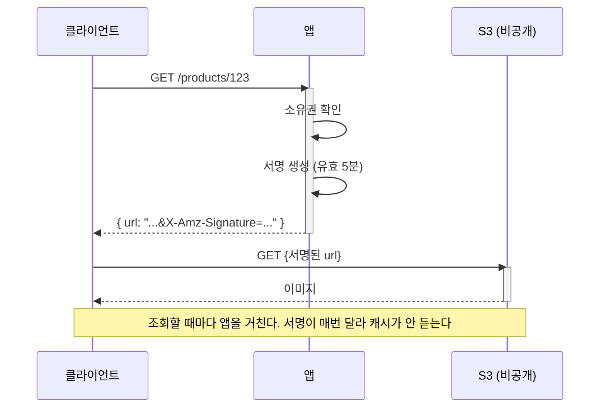
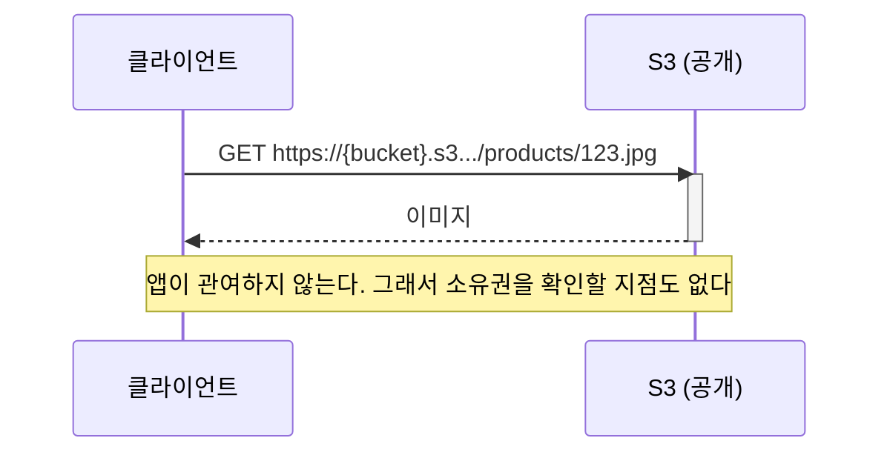
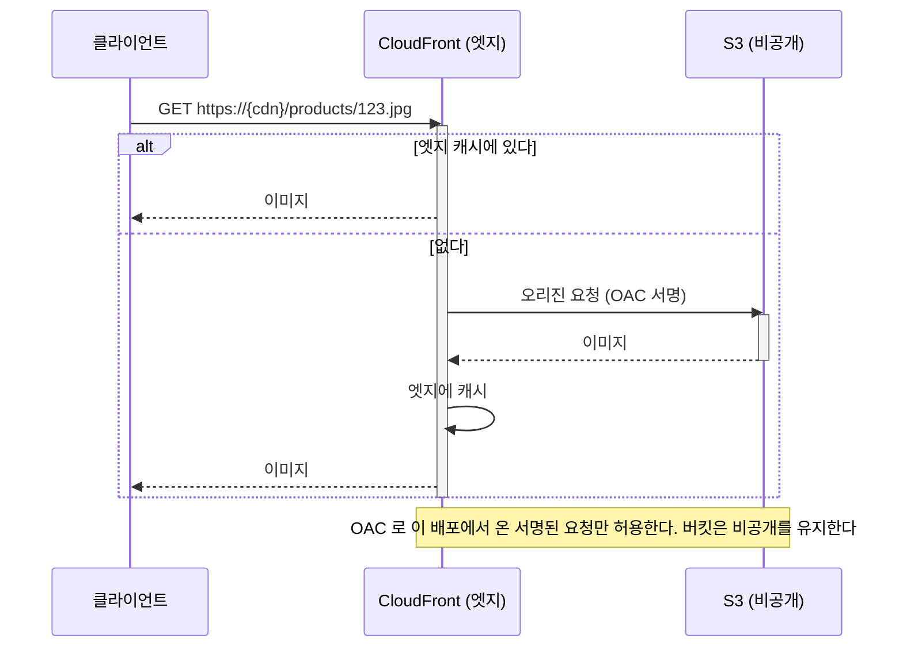
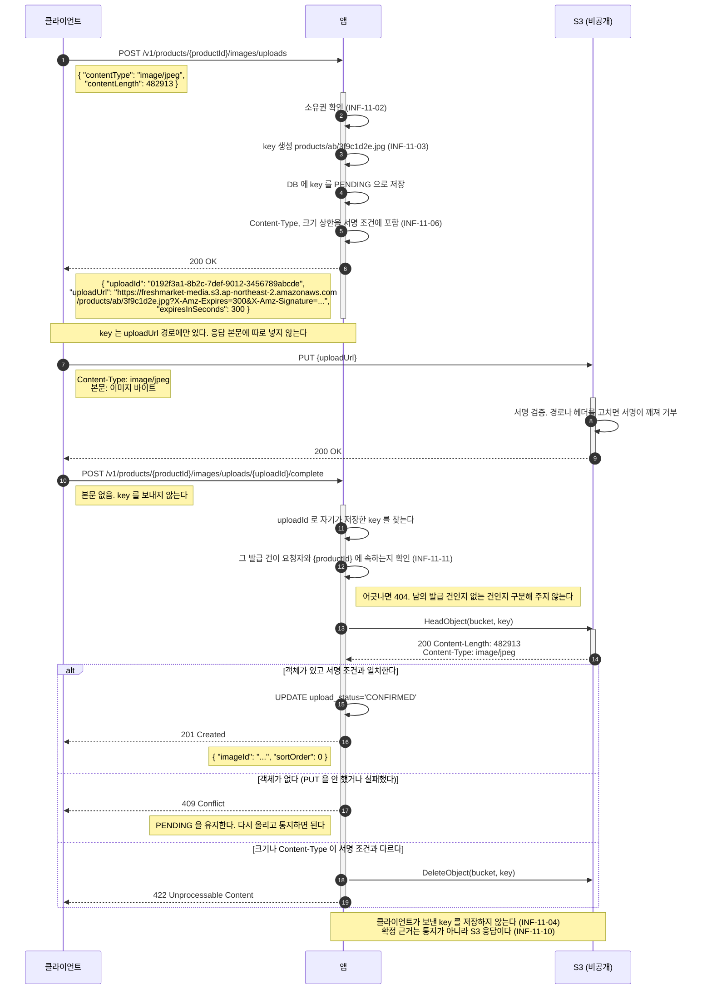
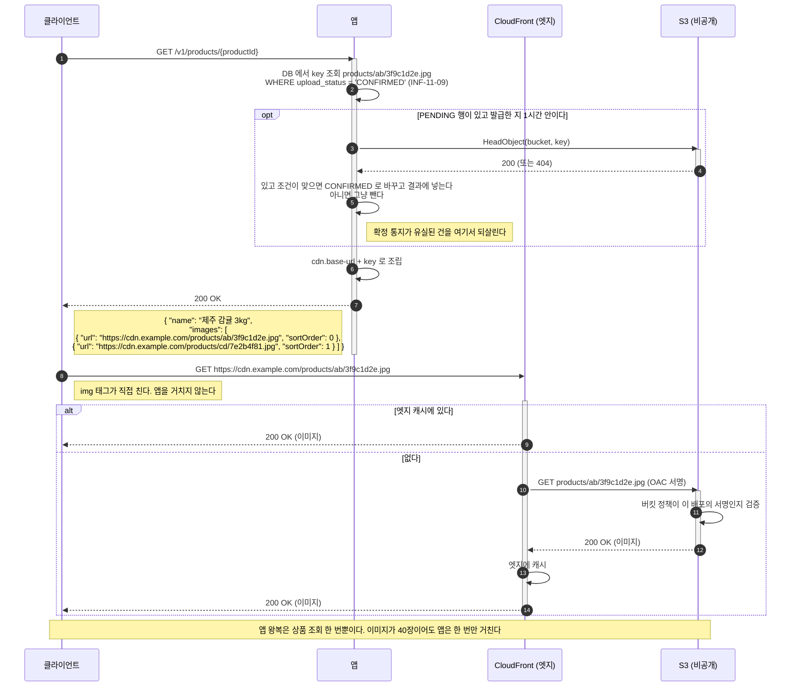
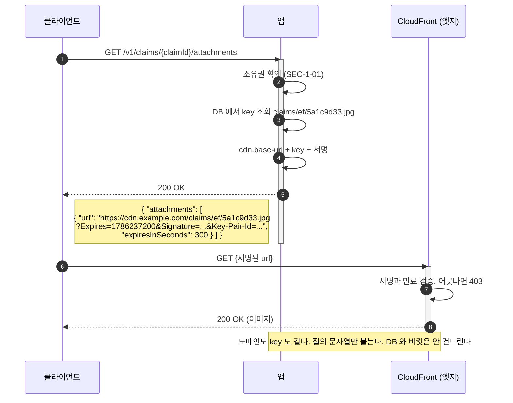

# 이미지 저장소: 설계 근거와 선택지 비교 (백엔드 공통)

작성 기준일: 2026-08-08
적용 대상: 신선식품 자사몰의 상품 이미지와 사용자 업로드 이미지
관련 문서: [백엔드공통_기술스택_확정문서.md](./백엔드공통_기술스택_확정문서.md), [백엔드공통_시스템디자인_종합.md](./백엔드공통_시스템디자인_종합.md)

**확정: CloudFront + OAC (3.3절)** 2026-08-08

이 문서는 그 결정의 근거로 남는다. 세 선택지를 비교한 내용은 그대로 둔다.
확정값은 기술 스택 확정 문서 2.6절과 5.2절에, 점검 항목은 `docs/infra-review/code-guideline.md` 11장에 있다.

---

## 1. 이미 정해진 것

| 항목 | 값 | 근거 |
|------|-----|------|
| 저장소 | S3 (ap-northeast-2) | 이미 Terraform 상태 저장에 사용 중 |
| 업로드 경로 | **presigned URL 로 클라이언트가 직접** | 앱 대역폭과 메모리를 쓰지 않는다 |
| 이미지 가공 | **없음. 원본만 저장** | 리사이징은 추가 인프라나 CPU 를 요구한다 |

업로드를 앱이 중계하지 않는 이유는 인스턴스가 `t3.small` 한 대이기 때문이다.
멀티파트 업로드를 앱이 받으면 톰캣 스레드가 파일 전송 시간만큼 잡히고, 요청 본문 크기 상한(`SEC-3-05`)도 함께 올려야 한다.

**남은 것은 "내려줄 때 어떻게 하는가" 하나다.**

## 2. 전제 조건

이 인프라의 확정 사항 중 판단에 영향을 주는 것들이다.

| 조건 | 값 | 영향 |
|------|-----|------|
| 앱 위치 | **퍼블릭 서브넷** | NAT 없이 S3 에 나갈 수 있다. VPC 엔드포인트가 필수는 아니다 |
| NAT Gateway | 없음 | 월 40 USD 절감이 목적. 이 결정은 되돌리지 않는다 |
| 월 예산 | 약 140 USD | 이미지 저장소가 큰 비중을 차지하면 안 된다 |
| 인스턴스 | `t3.small` x 1 | 버스트 크레딧에 의존한다. CPU 를 쓰는 선택은 불리하다 |

## 3. 선택지

### 3.1 presigned URL (비공개 버킷)



버킷은 완전 비공개다. 서명 없이는 아무도 못 읽는다.

**장점**

* `SEC-1-01`(리소스 접근 시 소유권 검증), `SEC-1-03`(목록 조회에도 소유자 조건)을 **앱이 완전히 통제**한다
* 버킷 공개 설정 자체가 없어 실수로 다른 파일이 노출될 여지가 없다
* 서명 만료로 링크 유출의 수명을 제한할 수 있다

**단점**

* **캐시가 안 된다.** URL 에 서명이 붙어 매번 달라지므로 브라우저도 CDN 도 재사용하지 못한다
* 조회할 때마다 앱을 거친다. 상품 목록 한 화면에 이미지 40장이면 서명 발급 40회다
* 같은 이미지를 100명이 보면 S3 에서 100번 전송된다. 전송비가 조회 수에 비례한다

**적합한 곳**: 주문서, 영수증, 본인만 봐야 하는 사진

### 3.2 퍼블릭 읽기 버킷



**장점**

* 가장 단순하다. 앱 부하가 0 이고 구성할 것이 버킷 정책 하나뿐이다
* URL 이 고정이라 브라우저 캐시가 그대로 듣는다
* 실패 지점이 적다

**단점**

* **소유권 검증이 원천적으로 불가능하다.** URL 을 아는 사람은 누구나 본다
* 버킷을 공개로 열어 두므로, 나중에 비공개 파일을 같은 버킷에 올리면 함께 노출된다
* 전송비는 조회 수에 비례한다. CDN 이 없어 엣지 캐시 이득이 없다

**적합한 곳**: 상품 카탈로그 이미지, 로고, 배너

### 3.3 CloudFront + OAC



**장점**

* 버킷이 비공개다. S3 URL 로 직접 접근하면 거부된다
* **엣지 캐시가 듣는다.** 같은 이미지의 두 번째 조회부터는 S3 를 안 거친다
* CloudFront 에는 상시 무료 구간이 있어(월 1TB 전송, 1000만 요청) 이 규모에서는 S3 직접 전송보다 쌀 가능성이 높다
* 나중에 서명된 쿠키나 URL 로 접근 제어를 얹을 수 있다. **구조를 안 바꿔도 된다**

**단점**

* 배포 하나가 추가된다. Terraform 구성, OAC, 버킷 정책이 늘어난다
* **무효화 정책이 생긴다.** 이미지를 교체했는데 엣지 캐시가 남는 문제를 다뤄야 한다
* 디버깅 계층이 하나 는다. 안 보이는 이미지의 원인이 S3 인지 CloudFront 인지 갈린다
* 배포 전파에 시간이 걸려 초기 구축과 변경이 즉시 반영되지 않는다

**적합한 곳**: 공개 이미지가 많고 조회가 잦은 경우

## 4. 비용

### 4.1 단가 (등급 C. 서울 단가 미검증)

**아래 값은 확인하지 않았다.** 기술 스택 확정 문서 5.1절이 밝힌 대로 총액의 상당 부분이 추정치이며, 이 표도 같은 상태다.
구축 확정 전에 AWS 요금 계산기로 검증한다.

| 항목 | 추정 단가 | 비고 |
|------|-----------|------|
| S3 Standard 저장 | 약 0.025 USD/GB/월 | |
| S3 GET 요청 | 약 0.0004 USD/1000건 | |
| S3 PUT 요청 | 약 0.005 USD/1000건 | 업로드 |
| S3 인터넷 전송 | 약 0.126 USD/GB | **비용의 대부분** |
| CloudFront 전송 | 약 0.12 USD/GB | 월 1TB 까지 무료 구간 |
| CloudFront 요청 | 약 0.009 USD/1만건 | 월 1000만건까지 무료 구간 |
| CloudFront 오리진 요청 | 0 USD | S3 와 같은 리전이면 전송비 없음 |

### 4.2 가정한 사용량 (등급 C)

**실측 전이라 전부 가정이다.** 규모가 달라지면 결론이 바뀔 수 있다.

| 항목 | 가정 |
|------|------|
| 상품 수 | 500개 |
| 상품당 이미지 | 3장 |
| 이미지 크기 | 300KB (원본만 저장하므로 큰 편) |
| 저장 총량 | 약 0.45GB |
| 월 이미지 조회 | 30만건 (목록 화면 중심) |
| 월 전송량 | 약 90GB |

### 4.3 선택지별 월 비용 (등급 C)

| 항목 | presigned | 퍼블릭 읽기 | CloudFront |
|------|-----------|-------------|------------|
| 저장 (0.45GB) | 0.01 | 0.01 | 0.01 |
| GET 요청 (30만) | 0.12 | 0.12 | 0.12 (오리진은 캐시 적중분만) |
| 전송 (90GB) | **11.34** | **11.34** | **0** (무료 구간 내) |
| CloudFront 요청 | - | - | 0 (무료 구간 내) |
| **합계** | **약 11.5 USD** | **약 11.5 USD** | **약 0.2 USD** |

**전송비가 전부를 가른다.** 저장과 요청은 어느 쪽이든 소액이다.

CloudFront 가 싼 이유는 무료 구간 때문이며, 월 1TB 를 넘으면 S3 직접 전송과 비슷해진다.
다만 캐시 적중분은 오리진 전송이 발생하지 않으므로, 넘더라도 S3 직접보다 유리하다.

**presigned 는 캐시가 안 되므로 실제 전송량이 더 클 수 있다.** 브라우저 재방문에서도 다시 받는다.

## 5. 비교

| | presigned | 퍼블릭 읽기 | CloudFront + OAC |
|---|---|---|---|
| 버킷 공개 | 비공개 | **공개** | 비공개 |
| 소유권 검증 | **가능** | 불가능 | 조건부 (서명 쿠키 추가 시) |
| 브라우저 캐시 | **안 됨** | 됨 | 됨 |
| CDN 캐시 | 안 됨 | 안 됨 | **됨** |
| 앱 부하 | 조회마다 서명 | 없음 | 없음 |
| 월 비용 (가정 기준) | 약 11.5 USD | 약 11.5 USD | **약 0.2 USD** |
| 구성 복잡도 | 낮음 | **가장 낮음** | 높음 |
| 나중에 접근 제어 추가 | 이미 있음 | **어렵다** | 가능 |

## 6. 판단

### 6.1 URL 이 만들어지는 방식

**DB 에는 key 만 둔다.** URL 은 조회할 때 조립한다.

```
DB    products/ab/3f9c1d2e.jpg                 <- key. 이것만 저장한다
설정  cdn.base-url: https://cdn.example.com    <- 프로파일마다 다르다
      s3.bucket-url: https://freshmarket-media.s3.ap-northeast-2.amazonaws.com

조회  https://cdn.example.com/products/ab/3f9c1d2e.jpg
업로드 https://freshmarket-media.s3.ap-northeast-2.amazonaws.com/products/ab/3f9c1d2e.jpg?X-Amz-Signature=...
```

**같은 key 에 도메인만 다르게 붙는다.** 조회는 CloudFront, 업로드는 S3 다.
CloudFront 는 경로를 변환하지 않고 그대로 객체 key 로 오리진에 묻는다. 그래서 도메인만 갈아 끼우면 된다.

#### key 저장과 URL 저장

클라이언트가 받는 것은 양쪽 다 완전한 URL 이다. **조립을 언제 하느냐만 다르다.**

| 쟁점 | 판단 |
|------|------|
| 비공개 버킷 (OAC) | **key / URL 무관.** 어느 쪽이든 버킷은 비공개다 |
| 도메인 교체 | key 가 유리. 설정 한 줄 대 전 행 UPDATE |
| 환경별 도메인 | key 가 유리. 프로파일로 처리한다 |
| **접근 제어 (서명 URL)** | **key 여야 가능** |

**첫 줄을 분명히 해 둔다.** key 저장은 버킷을 비공개로 두기 위한 조건이 아니다.
비공개 버킷은 OAC 설정의 문제이고, 전체 URL 을 저장해도 그것이 CloudFront 주소이면 버킷은 비공개로 남는다.

가운데 둘은 편의 차이다. URL 로 저장해도 되지만 바꿀 때 전 행을 건드린다.

#### 접근 제어 때문에 key 로 한다

넷 중 **"가능/불가능" 으로 갈리는 것은 마지막 하나뿐이고, 그것이 결정 근거다.**

```
공개 이미지    https://cdn.example.com/products/ab/3f9c1d2e.jpg
              고정값이라 저장할 수 있다

비공개 이미지  https://cdn.example.com/claims/ef/5a1c9d33.jpg
                ?Expires=1786237200&Signature=abc...&Key-Pair-Id=...
              발급할 때마다 서명과 만료가 달라진다. 저장할 수 있는 값이 아니다
```

3.3절이 CloudFront + OAC 를 고른 이유가 **"나중에 서명 URL 로 접근 제어를 얹어도 구조를 안 바꾼다"** 였다.
URL 을 통째로 저장하면 그 시점에 저장 방식부터 갈아엎어야 하므로 **채택 근거가 무효가 된다.**

지금은 상품 이미지밖에 없어 당장 못 하게 되는 것은 없다.
다만 6.1 이 비공개 이미지 후보(클레임 증빙, 공급처 서류, 비공개 리뷰)를 이미 식별했고,
**되돌리는 비용이 한쪽으로 크게 기운다.**

```
key 로 시작   URL 이 필요해지면 조회 코드 한 줄을 고친다
URL 로 시작   컬럼 이름, 저장된 값, 조회 코드를 함께 고친다. 그때는 데이터가 이미 들어 있다
```

`INF-11-05` 가 이 결정을 점검한다.

**key 는 서버가 만든다.**

```
products/{두 글자}/{난수}.jpg
```

클라이언트가 준 파일명을 쓰지 않는다. 경로 조작과 덮어쓰기가 가능해지기 때문이다 (`INF-11-03`).
앞 두 글자는 한 프리픽스에 객체가 몰리지 않게 나눈 것이다.

**공개 여부를 경로에 넣지 않는다.** 리뷰처럼 공개 여부가 운영 중에 바뀌는 것이 있어,
경로에 넣으면 토글 한 번이 객체 이동과 DB 수정이 된다.

### 6.2 채택안

**CloudFront + OAC 를 택했다.** 버킷은 하나이고 비공개다.

* 버킷을 공개하지 않으면서 캐시를 얻는다
* 비용이 가장 낮다 (가정 기준)
* 비공개 이미지가 생겨도 저장 구조와 key 를 그대로 둔 채 URL 발급만 바꾼다

구성이 늘어나는 것이 유일한 대가이며, Terraform 을 어차피 새로 쓰는 시점이므로 초기 비용으로 흡수된다.

#### 업로드



**업로드 URL 은 S3 호스트다.** presigned PUT 은 오리진에 직접 서명하는 것이라 구조상 그렇다.
`INF-11-01`(조회 URL 이 CloudFront 도메인인가)의 예외이며, 그 항목은 조회용 URL 을 대상으로 한다.

**완료 통지 본문에 key 가 없는 것이 요점이다.** key 를 돌려받아 저장하면 남의 key 를 실어 보내
남의 이미지를 자기 리소스에 붙일 수 있다. presigned 서명은 **올리는 것**만 막지 **저장하는 것**은 막지 못한다.

**그런데 `uploadId` 도 클라이언트가 보낸 값이다.** key 를 안 받았다고 끝이 아니다.
그것으로 행을 찾았다는 사실은 "그 발급 건이 존재한다" 만 말해 주지 "요청자 것이다" 를 말해 주지 않는다.
확인하지 않으면 남의 발급 건 번호를 실어 보내 남의 이미지를 자기 상품에 붙일 수 있고,
key 를 안 받은 것이 아무 소용이 없어진다. 그래서 확정할 때 두 가지를 같이 본다 (`INF-11-11`):

* 행의 `product_id` 가 경로의 `{productId}` 와 같은가
* 그 상품이 인증 주체의 것인가

발급 시점에 `INF-11-02` 로 한 번 확인했더라도 확정은 별개의 요청이다. 그 사이에 권한이 바뀌었을 수도 있다.

어긋나면 `403` 이 아니라 `404` 를 준다. `403` 은 "그 발급 건은 있는데 네 것이 아니다" 를 알려주는 것이라,
번호를 넣어 보며 남의 발급 건이 있는지 훑을 수 있게 된다.

**통지를 받았다는 사실만으로 확정하지 않는다.** 업로드가 앱을 거치지 않으므로 서버는 `PUT` 이 실제로 일어났는지 모른다.
통지는 클라이언트의 주장일 뿐이고, `PUT` 을 안 했거나 중간에 실패했어도 통지는 보낼 수 있다.
그대로 확정하면 **객체가 없는 key** 가 조회 응답에 실려 나간다. 그래서 `HeadObject` 로 S3 에 직접 묻는다 (`INF-11-10`).

S3 는 2020년 12월부터 `PUT` 에 강한 read-after-write 일관성을 보장하므로,
방금 올린 객체를 `HeadObject` 가 못 보는 경우는 없다. 지연을 감안한 재시도가 필요 없다.

**이 단계가 `INF-11-06` 을 완성한다.** 서명 조건은 올리는 것을 막을 뿐이고,
올라온 것이 조건과 같은지는 여기서만 확인된다.

#### 업로드 크기 상한 (등급 C)

**리사이즈는 클라이언트가 한다.** 앱은 가공하지 않으므로(1절) 올라온 원본이 그대로 조회에 나간다.

| 대상 | 상한 |
|------|------|
| `product_image` | **1MB** |
| `claim_attachment` | **2MB** |
| `shipment_photo` | **2MB** |

**공개 이미지는 무료 구간이 상한을 정한다.**

```
CloudFront 무료 전송   1TB / 월        (4.1절)
월 이미지 조회         30만건          (4.2절 가정)
                      1TB / 30만 = 약 3.5MB   <- 손익분기
```

이 선을 넘는 것이 실제로 아프다. 초과분이 0.12 USD/GB 라 전송이 2TB 가 되면 초과 1TB 에 약 123 USD 이고,
**월 예산 124 USD 와 맞먹는다.** 이미지 하나가 예산 전체를 삼킬 수 있는 구조라 여유를 크게 잡는다.

1MB 면 모든 이미지가 상한에 붙어도 300GB 로 무료 구간의 30% 다. 조회 수 가정이 세 배 틀려도 안전하다.
상품 사진 1200x1200 JPEG q85 가 통상 300~500KB 이므로 정상 리사이즈 결과의 2~3배이기도 하다.

**상한은 화질을 제약하는 값이 아니라 안전선이다.** 리사이즈를 건너뛴 클라이언트, 버그, 악의적 요청이
원본을 그대로 밀어 넣는 것을 막는 자리이며 정상 경로에서는 닿지 않는다.

**비공개 사진은 계산이 다르다.** 본인과 처리 담당 관리자만 보므로 한 장당 조회가 두세 번이고 전송량이 무시할 수준이다.
위쪽 한계가 없는 대신 파손 부위와 송장 번호를 판독해야 해서 공개 이미지보다 여유를 준다.
저장 비용은 2MB x 1000장이 2GB, 월 0.05 USD 다.

**등급 C 다.** 4.2절 가정에서 유도했고 그 가정은 실측된 적이 없다.

#### 상한을 강제하는 자리

세 겹이고 실제로 필요한 것은 첫째와 셋째다.

```
발급    설정 상한과 신고값 비교        초과면 400. 서명을 내주지 않는다
서명    contentLength 를 서명에 포함    다른 크기로 올리면 S3 가 403
업로드  브라우저가 Content-Length 자동  JS 로 설정할 수 없는 금지 헤더라 본문 크기가 그대로 들어간다
확정    HeadObject 로 상한 비교        초과면 422 + DeleteObject (INF-11-10)
```

**presigned PUT 은 범위 조건을 걸 수 없다.** `content-length-range` 는 POST policy 의 기능이다.
그래서 클라이언트가 신고한 정확값을 서명에 넣고, 상한 검사는 발급 요청을 받은 자리에서 한다.
크게 신고하면 발급에서 걸리고, 작게 신고하고 큰 파일을 올리면 서명 불일치로 S3 가 거부한다.

**POST policy 를 쓰지 않은 이유**는 Java SDK v2 에 presigned POST 생성 기능이 없어
정책 문서와 HMAC 서명을 직접 만들어야 하기 때문이다. 서명 코드를 손으로 쓰는 것은 틀리기 좋은 자리이고,
얻는 것은 낭비되는 업로드 대역폭을 막는 것뿐이다. 데이터 안전성은 `HeadObject` 대조가 이미 보장한다.

`X-Amz-SignedHeaders` 에 `content-length` 가 실제로 들어가는지는 구현할 때 확인한다.
안 들어가더라도 발급 검사와 `HeadObject` 대조만으로 닫힌다. **두 번째 줄은 없으면 못 쓰는 것이 아니라 없어도 되는 것이다.**

다만 그 경우 상한을 넘은 파일이 **S3 에 올라간 뒤에** 지워진다. 업로드 대역폭과 `PUT` 요청 비용은 이미 나갔고,
앱을 거치지 않는 구조라 되돌릴 수 없다. 반복하는 클라이언트는 발급 요청 제한으로 막아야 하는데 아직 없는 항목이다.

**상한은 모든 업로드에 공통인 설정값이지 객체의 속성이 아니므로 DB 에 넣지 않는다.**

#### 크기와 Content-Type 을 저장하지 않는다

이미지 행에 남는 것은 다섯이다.

```sql
upload_id      -- 확정 통지에서 이 행을 찾는다        INF-11-04
object_key     -- URL 을 만들 유일한 재료             INF-11-05
upload_status  -- 조회 제외와 정리 대상 판단          INF-11-09, 13
created_at     -- 조회 확정 창과 정리 유예의 기준     INF-11-12, 13
updated_at
```

크기와 `Content-Type` 은 없다. **읽는 자리가 없기 때문이다.**

| 언제 | 필요한가 |
|------|---------|
| 발급 | 요청 본문의 값을 그 자리에서 상한, 허용 목록과 비교하고 서명에 넣는다. 저장 불필요 |
| 확정 | 서명이 이미 강제했다. 대조할 것이 없다 |
| 조회 | **S3 객체 메타데이터가 브라우저까지 그대로 간다.** 앱은 관여하지 않는다 |
| 삭제, 정리 배치 | 안 쓴다 |

세 번째가 핵심이다. `PUT` 에 실려 간 `Content-Type` 헤더가 그대로 객체 메타데이터가 되고,
조회할 때 S3 -> CloudFront -> 브라우저로 응답 헤더에 실려 나간다. 브라우저가 이미지를 그릴 때 쓰는 값이 그것이다.

```
업로드  PUT ... Content-Type: image/jpeg    -> S3 가 객체에 기록한다
조회    GET https://cdn.../3f9c1d2e.jpg
        <- 200 Content-Type: image/jpeg     -> 브라우저가 받는다. 앱을 안 거친다
```

**앱이 사본을 들고 있어도 아무도 그것을 보지 않는다.** 진실의 원천이 S3 객체 메타데이터이므로,
DB 에 두면 두 곳이 어긋날 수 있는 자리만 하나 더 생긴다.

상한과 허용 목록도 마찬가지다. 모든 업로드에 공통인 설정값이지 이 객체의 속성이 아니다.

**확정 여부는 `upload_status` 하나로 표현한다.** 크기를 저장하면 그 값이 있다는 것 자체가
`HeadObject` 를 불렀다는 흔적이 되어 `INF-11-10` 준수가 데이터에 남는 이점이 있지만,
쓰지도 않는 컬럼을 감사 흔적만으로 유지할 값은 아니라고 봤다.

#### 조회

이미지 한 장마다 앱을 부르지 않는다. **리소스 응답에 URL 이 실려 나가고 브라우저가 CloudFront 를 직접 친다.**



#### 대표 이미지를 고르는 방법

`product_image.is_main` 이 대표를 표시한다. 상품당 하나임은 DB 가 강제한다
(`is_main_key` 계산 컬럼 + `uk_product_image_single_main`).

**조회는 `is_main` 을 조건이 아니라 정렬 우선순위로 쓴다.**

```sql
WHERE product_id = ? AND upload_status = 'CONFIRMED'
ORDER BY is_main DESC, sort_order ASC, product_image_id ASC
LIMIT 1
```

`WHERE is_main = TRUE` 로 짜면 **대표를 지운 순간 썸네일이 사라진다.** DB 는 "대표 최대 하나" 만 강제하지
"최소 하나" 는 강제하지 않으며, 그럴 수도 없다. 이미지가 아직 없거나 전부 `PENDING` 인 상태가 정상이기 때문이다.

대표가 없는 상태는 세 경우에 생기고 정렬 폴백이 셋을 모두 같게 처리한다.

* 대표를 지정한 적이 없다
* 대표였던 이미지를 지웠다
* 대표가 아직 `PENDING` 이라 `chk_product_image_main` 에 걸려 `TRUE` 가 될 수 없다

**삭제할 때 다음 이미지를 대표로 자동 승격시키지 않는다.** `is_main` 에 쓰기가 한 번 더 생기는데
정렬 폴백이 같은 결과를 주고 그쪽은 쓰기가 없다. 대표 교체는 사용자가 지목했을 때만 일어난다.

교체는 서버가 한 트랜잭션에서 처리하고 **옛 대표를 먼저 내린다.** 새것을 먼저 올리면 유일성 위반이다.

```sql
UPDATE product_image SET is_main = FALSE WHERE product_id = ? AND is_main = TRUE;
UPDATE product_image SET is_main = TRUE  WHERE product_image_id = ? AND product_id = ?;
```

클라이언트에게 `isMain` 불리언을 받지 않고 **어느 것을 대표로 할지 지목만 받는다.**
불리언을 받으면 `false` 로 만드는 요청도 받아야 하고, 교체가 두 번의 호출로 쪼개져
중간에 "대표 둘" 이나 "대표 없음" 이 노출된다.

**업로드 확정 요청에 `isMain` 을 싣지 않는다.** 확정 경로가 둘이기 때문이다.
클라이언트 통지로 확정할 때는 실을 자리가 있지만, 조회 확정(`INF-11-12`)에는 클라이언트 요청 자체가 없다.
확정에 묶으면 통지가 유실됐다가 조회로 살아난 이미지는 대표가 될 방법이 없어져 두 경로의 동작이 갈린다.
확정은 "업로드가 끝났다" 만 기록하고 대표 지정은 상품 편집으로 둔다.

#### 표시 순서

`product_image.sort_order` 가 한 상품 안에서 이미지를 늘어놓는 순서다. 작을수록 앞이다.
**대표 여부와는 별개 축이라** 대표가 아닌 이미지가 `sort_order = 0` 일 수 있다.

```
product_id  is_main  sort_order
    1        FALSE       0        상세에서 첫 번째로 보이지만 대표는 아니다
    1        TRUE        1        썸네일로 쓰이는 것
    1        FALSE       2
```

썸네일 한 장을 고를 때는 `is_main` 이 앞서고, 상세에서 여러 장을 늘어놓을 때는 `sort_order` 만 쓴다.

**`(product_id, sort_order)` 에 유일성을 걸지 않는다.** 재정렬의 중간 상태가 항상 위반이 되기 때문이다.

```
A:0 B:1 C:2 에서 C 를 맨 앞으로
  C 를 0 으로 바꾸는 순간  A:0 C:0  -> 위반
```

임시값이나 간격 저장(10, 20, 30)으로 우회할 수 있지만, 순서 변경이 흔한 목록에서 그 복잡도를 지불할 이유가 없다.
대신 **결정적 순서는 타이브레이커로 얻는다.**

```sql
ORDER BY is_main DESC, sort_order ASC, product_image_id ASC
```

`sort_order` 가 겹쳐도 `product_image_id` 가 갈라 주므로 같은 요청에 같은 순서가 나온다.
정렬의 세 번째 키가 있는 이유가 이것이다.

**값은 서버가 정한다.** 컬럼 기본값이 `0` 이라 앱이 넣지 않으면 모든 이미지가 `0` 이 되고,
실질 정렬이 `product_image_id` 순(올린 순서)으로 떨어져 컬럼이 무의미해진다.
새 이미지는 확정할 때 맨 뒤에 붙인다.

```sql
SELECT COALESCE(MAX(sort_order) + 1, 0) FROM product_image WHERE product_id = ?
```

재정렬은 대표 지정과 마찬가지로 별도 요청이다. **클라이언트가 순서 배열을 통째로 보내고 서버가 `0..n-1` 로 다시 쓴다.**
유일성이 없으니 중간 상태를 신경 쓸 필요가 없고, 부분 갱신보다 어긋날 여지가 적다.

#### 조회 확정

**확정 통지가 유실되면 객체는 S3 에 있는데 행은 `PENDING` 으로 남는다.** 업로드가 앱을 거치지 않아서 서버는 그 사실을 모르고,
클라이언트도 통지가 실패한 뒤 재시도하지 않으면 알릴 방법이 없다. 그러면 아무도 참조하지 않는 객체가 남는다.

조회할 때 되살린다. 통지가 유실된 직후라면 그 리소스를 다시 여는 것이 보통이므로, 그 조회가 복구 시점이 된다.
확정 근거는 여전히 `HeadObject` 이므로 `INF-11-10` 과 어긋나지 않는다.

**조건 다섯 가지가 붙는다.**

**1. 단건 조회에만 둔다.** `GET /v1/products/{productId}` 는 이미지 수에 상한이 있다.
목록(`GET /v1/products`)에 넣으면 상품 수 × 이미지 수만큼 동기 외부 호출이 될 수 있어 p99 가 S3 지연에 묶인다.
지금 상품 목록은 S3 의존이 없고, 그것을 깨는 값은 크다. 목록은 `CONFIRMED` 만 걸러 내보낸다.

**2. 발급한 지 1시간 안인 행만 시도한다.**

```sql
WHERE upload_status = 'PENDING' AND created_at > :threshold
```

기준시각은 애플리케이션 `Clock` 으로 계산해 넘긴다. SQL 의 `now()` 를 쓰면 DB 시각과 인스턴스 시각 두 기준이
공존하게 되고, 같은 값을 쓰는 정리 배치와 경계가 어긋난다 (`INF-1-09`).

**이 조건이 없으면 조회가 영영 끝나지 않는 재시도가 된다.** 확정될 수 없는 행(발급만 받고 안 올린 것, 조건이 어긋난 것)은
계속 `PENDING` 이므로, 그 리소스를 볼 때마다 `HeadObject` 가 다시 나간다. 결과가 매번 같은데 매번 묻게 된다.
1시간이 지난 행은 어차피 정리 대상이므로 물어볼 이유가 없다.
**조회 확정의 유효 창과 정리 유예 시간이 같은 값 하나를 쓴다.**

**3. `PENDING` 행이 하나도 없으면 S3 를 건드리지 않는다.** 정상 상태에서는 거의 전부 `CONFIRMED` 라 실제로는 드물게만 나가는 호출이다.

**4. 확정 `UPDATE` 를 조회 트랜잭션에 섞지 않고 조건부로 쓴다.**

```sql
UPDATE product_image
   SET upload_status = 'CONFIRMED'
 WHERE product_image_id = ? AND upload_status = 'PENDING'
```

같은 리소스를 동시에 조회한 요청들이 같은 행을 확정하려 든다. `WHERE upload_status = 'PENDING'` 을 붙이면 하나만 먹고 나머지는 0건이라 무해하다.
응답은 `UPDATE` 를 기다릴 것 없이 `HeadObject` 가 통과한 시점에 URL 을 실으면 된다.

**5. 대조에 실패하면 조회가 처리하지 않는다.** 크기나 `Content-Type` 이 서명 조건과 다르면 확정만 하지 않고 `PENDING` 으로 둔다.
그 객체를 지우는 것은 정리 배치 몫이다. 상품 상세 조회가 S3 객체를 삭제하는 구조는 만들지 않는다.

#### 조회 확정이 닿지 않는 곳

**조회 확정은 되살릴 수 있는 것만 되살린다. 치우는 일은 못 한다.** 둘은 대상이 반대다.

| 상황 | S3 객체 | 조회 확정 | 남는 것 |
|------|---------|-----------|---------|
| 발급만 받고 올리지 않음 | 없음 | 못 함 (`HeadObject` 404) | DB 행 |
| 올렸고 통지 유실, **다시 조회함** | 있음 | **되살림** | 없음 |
| 올렸고 통지 유실, 다시 조회 안 함 | 있음 | 못 함 | 객체 + 행 |
| 올렸으나 크기/타입이 조건과 어긋남 | 있음 | 못 함 (조건 5) | 객체 + 행 |
| 리소스가 삭제되어 조회 경로가 없음 | 있음 | 못 함 | 객체 + 행 |

그래서 정리 배치가 함께 필요하다. **대상은 조회 확정의 여집합이다.** 같은 기준시각을 반대 방향으로 쓴다.

```sql
WHERE upload_status = 'PENDING' AND created_at <= :threshold
```

```
created_at >  기준시각   조회 확정이 되살린다   (아직 살릴 수 있다)
created_at <= 기준시각   배치가 지운다          (살릴 시간이 지났다)
```

**S3 객체를 먼저 지우고 그 다음 행을 지운다.** 순서가 반대면 key 를 잃어버려 객체를 영영 못 찾는다.
`DeleteObject` 는 없는 객체에도 성공하므로 표 첫 줄처럼 객체가 아예 없는 경우도 같은 경로로 정리된다.

별도의 작업 큐를 두지 않고 **테이블 자체를 큐로 쓴다.** 상태와 나이만으로 대상이 정해지므로 지울 목록을 따로 유지할 필요가 없고,
한 주기에 놓친 행은 다음 주기에 다시 걸려 유실이 없다. 대가는 지연이며 주기만큼 늦게 치운다.

**`INF-1-01` 의 분류에서 외부 부수효과형이다.** `DeleteObject` 가 외부 호출이고 되돌릴 수 없다.
그 항목이 락을 필수로 요구하는 두 유형 중 하나이므로 1장 항목이 그대로 적용된다.

| 항목 | 이 배치에 적용하면 |
|------|-------------------|
| `INF-1-02` | 락 이름을 이 배치 전용으로 둔다 |
| `INF-1-03` | TTL 이 주기보다 짧아야 한다 |
| `INF-1-06` | S3 삭제 **전에** 조건부 `UPDATE` 로 행을 선점한다 |
| `INF-1-07` | 락 획득 트랜잭션과 작업 트랜잭션을 분리한다 |
| `INF-1-09` | 기준시각을 애플리케이션 `Clock` 으로 계산해 넘긴다 |

세 이미지 테이블에 `(upload_status, created_at)` 인덱스가 필요하다. 없으면 매 주기 풀스캔이 된다.
`PENDING` 이 드물어서 인덱스가 있으면 아주 짧은 구간만 훑고 끝난다.

#### 비공개 이미지가 생기면

저장은 그대로 두고 **URL 을 만드는 코드에만 서명을 더한다.**



공개 여부가 행마다 갈리는 것(리뷰, QnA)은 **비공개 행에 URL 자체를 안 준다.**

```
GET /v1/products/{productId}/reviews

200 {
  "reviews": [
    { "id": "...", "isPublic": true,  "images": [ { "url": "https://cdn.example.com/reviews/1a/9f3c2e08.jpg" } ] },
    { "id": "...", "isPublic": false, "images": [] }
  ]
}
```

URL 을 주고 접근을 막으면 그 URL 은 이미 새어 나간 것이다.
`SEC-1-03`(목록 조회에서도 소유자 조건이 쿼리에 포함되는가)이 이 자리이며, 목록을 만들 때 걸러야지 응답을 만든 뒤 지우면 늦다.

### 6.3 지금 결정하지 않아도 되는 것

| 항목 | 정해야 할 때 |
|------|--------------|
| 조회 확정을 어느 테이블에 적용할지 | 업로드 구현 시 |
| 정리 유예 시간 (위에서는 1시간을 예로 썼다) | 업로드 구현 시 |
| presigned 만료 시간 | 업로드 구현 시 |
| 무효화 정책 (CloudFront 채택 시) | 이미지 교체 기능이 생길 때 |
| 버킷 수명 주기 (오래된 이미지 정리) | 저장량이 문제될 때 |
| 리사이징 도입 | 원본 전송량이 문제될 때 |

**조회 확정 적용 범위가 갈리는 지점**은 서버가 "확정 통지가 유실됐다" 와 "사용자가 확정하지 않고 그만뒀다" 를
구분할 수 없다는 것이다. 둘 다 `PENDING` + 객체 있음 으로 똑같이 보인다.
조회할 때 확정한다는 것은 **"올린 것은 붙이려던 것이다" 를 정책으로 채택하는 것**이 된다.

`product_image` 는 판매자가 상품에 붙이려고 올린 것이고 잘못 붙어도 본인이 보고 지울 수 있어 그 가정이 안전하다.
`claim_attachment` 와 `shipment_photo` 는 집 안과 현관이 찍힌 사진이라 잘못 붙으면 되돌릴 수 없다.
다만 제3자에게 새는 것은 아니고 본인과 처리 담당 관리자에게 보이는 범위다. 감수할지 여부가 판단할 대목이다.

세 이미지 테이블이 나뉘어 있어 이 결정을 테이블 단위로 내릴 수 있다. 다형 테이블 하나였다면 행마다 따져야 했다.

## 7. 정해지면 반영할 곳

| 문서 | 무엇을 |
|------|--------|
| `백엔드공통_기술스택_확정문서.md` 2.6절 | AWS 리소스 표에 S3 버킷과 CloudFront |
| 같은 문서 5.2절 | 월 운영 비용에 추가 |
| `docs/infra-review/code-guideline.md` | 점검 항목 (버킷 공개 여부, presigned 만료, 업로드 검증) |
| `docs/infra-review/pending-decisions.md` | 결정되면 해당 항목 제거 |

점검 항목은 `SEC-3-04`(파일 업로드에서 확장자, MIME 타입, 크기, 저장 경로를 검증하는가)와 겹친다.
**일반론은 `fresh-market/.github` 가 갖고, 이 인프라의 확정값(버킷 이름 규칙, 만료 시간 등)은 여기가 갖는다.**
